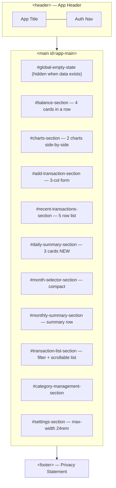
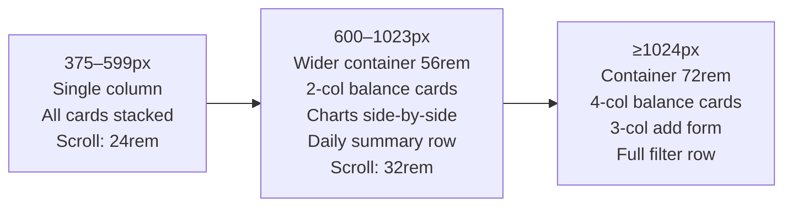
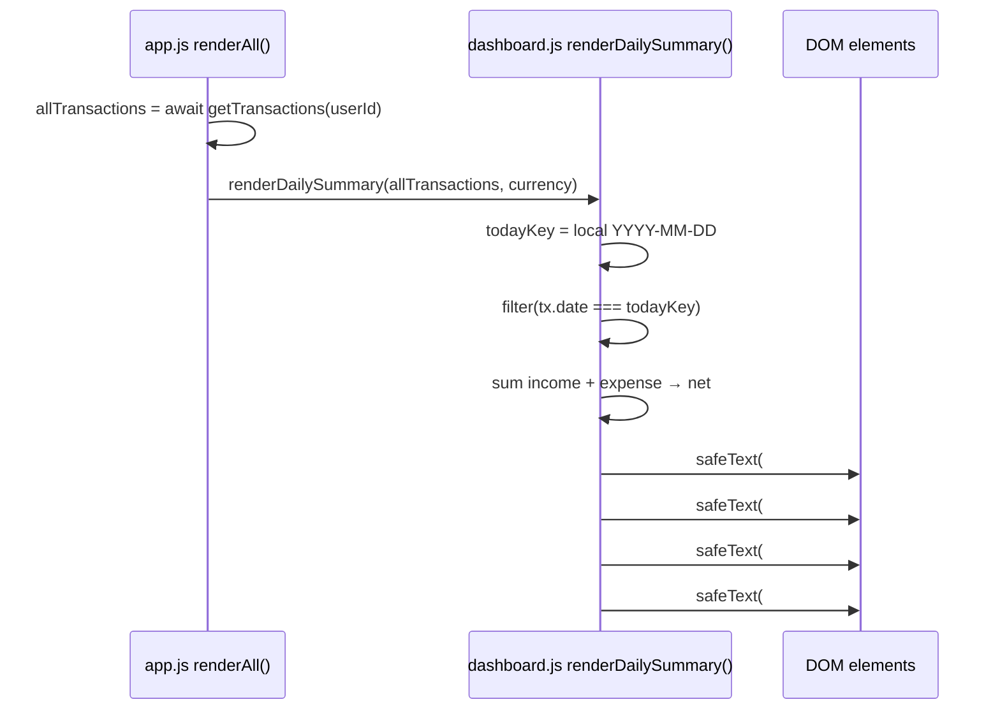

# Design Document: Dashboard UI Redesign

## Overview

This is a **presentation-only redesign** of the Personal Finance Tracker. The application already implements all core business logic: Supabase authentication, cloud/local storage, RLS security, transaction CRUD, filtering, charting, monthly reporting, category management, and multi-currency support.

The goal is to replace the current HTML structure and CSS with a modern, clean, finance-oriented dashboard aesthetic while preserving every existing JavaScript module, business logic function, DOM ID, and storage architecture without modification.

**Scope of changes:**

| File | Change type | Reason |
|---|---|---|
| `index.html` | Reorganize | Section reorder (move existing sections), add Daily Summary section, add scroll wrapper div |
| `css/styles.css` | Extend | New tokens, enhanced component styles, Daily Summary styles |
| `js/dashboard.js` | Minimal addition | `renderDailySummary()` export + add to `DATA_SECTION_IDS` |
| `js/app.js` | Minimal addition | Call `renderDailySummary()` inside `renderAll()` |

**No other JavaScript files are modified.** `storage.js`, `transactions.js`, `categories.js`, `charts.js`, `reports.js`, `utils.js`, `auth.js`, `supabase.js`, `supabase-storage.js`, `config.js`, and `migration.js` are untouched.

---

## Architecture

The existing layered architecture is preserved:

```
UI Layer         index.html + css/styles.css
                 dashboard.js (render)  ← adds renderDailySummary()
                 app.js (orchestration) ← adds renderDailySummary() call

Business Logic   transactions.js, categories.js, reports.js, charts.js
                 (no changes)

Storage          storage.js → supabase-storage.js / localStorage
                 (no changes)
```

The Daily Summary section is purely additive. It reads from the already-fetched in-memory transaction array inside `renderAll()` — no new network calls, no new storage keys, no schema changes.

`renderDailySummary` is a synchronous pure rendering function. It must NOT call `transactions.getTransactions()`, access Supabase directly, use the StorageProvider, or read from localStorage. It receives the `allTransactions` array already fetched by `renderAll()` and performs only in-memory filtering and DOM writes. The existing single-fetch optimization introduced in the Round 3 preloaded transaction pattern is fully preserved: `getTransactions(userId)` is called exactly once per `renderAll()` invocation, and the resulting array is shared with `renderDashboard`, `renderDailySummary`, `renderReports`, and `renderTransactionList`.

```
renderAll() in app.js
  │
  ├─ transactions.getTransactions(userId)  [one fetch, reused]
  │
  ├─ dashboard.renderDashboard(state, userId, allTransactions)
  ├─ dashboard.renderDailySummary(allTransactions, currency)  ← NEW
  ├─ renderReports(allTransactions)
  └─ renderTransactionList(allTransactions)
```

---

## Components and Interfaces

### 2.1 HTML Section Order

The `<main id="app-main">` element must contain sections in this exact order:

```
1.  #global-empty-state
2.  #balance-section          (Overview)
3.  #charts-section           (Charts)
4.  #add-transaction-section  (Add Transaction)
5.  #recent-transactions-section
6.  #daily-summary-section    ← NEW
7.  #month-selector-section
8.  #monthly-summary-section
9.  #transaction-list-section (with internal scroll wrapper)
10. #category-management-section
11. #settings-section
```

This reorder moves `#charts-section` above `#add-transaction-section` (from its current position after `#monthly-summary-section`), and inserts the new `#daily-summary-section` between `#recent-transactions-section` and `#month-selector-section`.

### 2.2 Daily Summary Section HTML

New section, inserted at position 6:

```html
<!-- Daily summary: today's income, expense, net balance (Req 8) -->
<section class="section daily-summary-section" id="daily-summary-section"
         aria-labelledby="daily-summary-heading">
  <h2 class="section-heading" id="daily-summary-heading">Today</h2>
  <p class="daily-summary__date" id="daily-summary-date"></p>
  <div class="daily-summary-cards">
    <article class="daily-summary-card daily-summary-card--income">
      <h3 class="daily-summary-card__label">Income Today</h3>
      <p class="daily-summary-card__value u-text-income"
         id="daily-income-value"></p>
    </article>
    <article class="daily-summary-card daily-summary-card--expense">
      <h3 class="daily-summary-card__label">Expense Today</h3>
      <p class="daily-summary-card__value u-text-expense"
         id="daily-expense-value"></p>
    </article>
    <article class="daily-summary-card">
      <h3 class="daily-summary-card__label">Net Today</h3>
      <p class="daily-summary-card__value" id="daily-net-value"></p>
    </article>
  </div>
</section>
```

**New IDs introduced:** `daily-summary-section`, `daily-summary-date`, `daily-income-value`, `daily-expense-value`, `daily-net-value`. None conflict with any existing ID.

### 2.3 Transaction List — Internal Scroll Wrapper

Inside `#transaction-list-section`, wrap `#transaction-list` and `#transaction-list-empty` in a scroll container. The filter controls remain **outside** the wrapper:

```html
<section class="section transaction-list-section" id="transaction-list-section" ...>
  <h2 class="section-heading" id="transaction-list-heading">Transactions</h2>

  <!-- Filter controls: outside the scroll container so they stay visible -->
  <form class="filter-controls" id="filter-controls" ...>
    ...
  </form>

  <!-- Internal scroll container: clips and scrolls the transaction rows -->
  <div class="transaction-list-scroll" tabindex="0"
       aria-label="Transaction list, scrollable">
    <ul class="transaction-list" id="transaction-list"></ul>
    <p class="empty-state" id="transaction-list-empty" hidden></p>
  </div>
</section>
```

The `tabindex="0"` allows the container to receive keyboard focus and be scrollable via arrow keys (Req 16.6).

---

## Data Models

No new data models or storage structures are introduced.

**`renderDailySummary` function signature** (pure render function, no storage interaction):

```
renderDailySummary(transactions: Transaction[], currency: string) → void
```

Inputs:
- `transactions`: the in-memory array already fetched by `renderAll()` — same reference passed to `renderDashboard()`
- `currency`: `state.selectedCurrency` — the active ISO 4217 currency code

Side effects: writes formatted strings to `#daily-income-value`, `#daily-expense-value`, `#daily-net-value`, `#daily-summary-date`.

**Today Key derivation** (Req 8.2 — local date, not UTC):

```javascript
const d = new Date();
const year  = d.getFullYear();
const month = String(d.getMonth() + 1).padStart(2, '0');
const day   = String(d.getDate()).padStart(2, '0');
const todayKey = `${year}-${month}-${day}`;
```

This produces the correct local calendar date in all timezones, including UTC+7 (Jakarta) where `toISOString().slice(0, 10)` would return the previous day at times before 07:00 local.

---

## Correctness Properties

*A property is a characteristic or behavior that should hold true across all valid executions of a system — essentially, a formal statement about what the system should do. Properties serve as the bridge between human-readable specifications and machine-verifiable correctness guarantees.*

The only new computational logic introduced is `renderDailySummary()` — a pure filtering and aggregation function. CSS and HTML changes are presentational and not amenable to property-based testing. The following properties apply to `renderDailySummary`.

---

### Property 1: Daily net is income minus expense

*For any* array of transactions and any currency code, after `renderDailySummary` executes, the value rendered in `#daily-net-value` must equal the sum of today's income amounts minus the sum of today's expense amounts, formatted through the same currency formatter applied to `#daily-income-value` and `#daily-expense-value`.

**Validates: Requirements 8.1**

---

### Property 2: Only today's local-date transactions are counted

*For any* array of transactions containing a mix of dates, `renderDailySummary` must include in its totals only those transactions whose `date` field exactly equals the local calendar YYYY-MM-DD string for the current day, excluding all transactions with any other date (past or future).

**Validates: Requirements 8.2, 8.3**

---

### Property 3: Empty-day produces zero-formatted values

*For any* array of transactions where no transaction's `date` matches today's local key (including an empty array), `renderDailySummary` must render zero-formatted currency strings (e.g., "Rp 0") in all three value elements rather than blank, `undefined`, or `NaN`.

**Validates: Requirements 8.9**

---

### Property 4: Daily summary is independent of Selected_Month

*For any* set of transactions and any value of `state.selectedMonth`, the values rendered by `renderDailySummary` must be identical regardless of what `state.selectedMonth` is set to, because `renderDailySummary` receives the full transaction array and computes its own today-key independently.

**Validates: Requirements 8.5**

---

## Error Handling

### CSS token fallbacks
All new CSS variables are declared in `:root` with concrete values. No JavaScript reads CSS variables directly, so a missing token degrades gracefully to the browser's default rather than throwing.

### `renderDailySummary` defensive guards
- If `transactions` is not an array, default to `[]`
- If `currency` is empty or undefined, default to `"IDR"` (matching the existing pattern in `renderDashboard`)
- If any DOM element (`#daily-income-value`, `#daily-expense-value`, `#daily-net-value`, `#daily-summary-date`) is absent, skip that write silently — same pattern as `renderMoneyValue` in `dashboard.js`
- Amounts that are not finite numbers (NaN, Infinity) default to `0` before formatting — same behavior as `calculateTotals` in `transactions.js`

### Internal scroll container
The scroll container is a presentational `<div>` with no JS wiring. If JS adds rows to `#transaction-list`, they naturally appear inside the scroll container because `#transaction-list` is a child. No additional error handling is needed.

---

## Testing Strategy

### Unit tests (example-based)

The following concrete examples should be tested:

**`renderDailySummary` function (dashboard.js):**

1. **With today's transactions** — call with an array containing 2 income and 1 expense transactions all dated today; assert income, expense, and net DOM values are correctly formatted.
2. **With no matching transactions** — call with an array of transactions all dated yesterday or tomorrow; assert all three value elements show zero-formatted currency.
3. **With mixed-date transactions** — call with one today, one yesterday, one tomorrow; assert only today's transaction contributes to the totals.
4. **With an empty array** — call with `[]`; assert zero-formatted values and a non-empty date label.
5. **Date label format** — call `renderDailySummary`; assert `#daily-summary-date` contains a non-empty string (the formatted local date).

**DOM structure checks (example-based):**

6. **Section order in `<main>`** — assert the siblings of `<main id="app-main">` appear in the required order: `#global-empty-state` → `#balance-section` → `#charts-section` → `#add-transaction-section` → `#recent-transactions-section` → `#daily-summary-section` → `#month-selector-section` → `#monthly-summary-section` → `#transaction-list-section` → `#category-management-section` → `#settings-section`.
7. **All preserved IDs present** — assert that every ID listed in Requirements 3–13 and 17 exists in the document.
8. **Scroll container structure** — assert that `#transaction-list` and `#transaction-list-empty` are children of `.transaction-list-scroll`, and that `.transaction-list-scroll` is NOT a descendant of `#filter-controls`.
9. **Scroll container accessibility** — assert that `.transaction-list-scroll` has `tabindex="0"`.
10. **Daily Summary new IDs** — assert that `#daily-summary-section`, `#daily-summary-date`, `#daily-income-value`, `#daily-expense-value`, `#daily-net-value` all exist and do not collide with any pre-existing ID.

### Validation approach for correctness properties

The four correctness properties are verified through code inspection and focused example-based tests. No external property-based testing library is required.

- **Property 1 (net = income − expense):** Verify by code inspection of the `renderDailySummary` function — confirm the subtraction `income - expense` is computed and passed to `formatCurrency` for the net element. Confirm with two focused example-based tests: one where income > expense (net is positive), and one where expense > income (net is negative).

- **Property 2 (only today's transactions):** Verify by code inspection that the filter condition is `tx.date === todayKey` (strict string equality, no type coercion). Confirm with focused example-based tests using a mix of transactions dated yesterday, today, and tomorrow — assert only today's transactions contribute to the totals.

- **Property 3 (zero on empty day):** Verify by code inspection that `income` and `expense` are initialized to `0` before the loop, so an empty `todayTxs` array produces `0` for both. Confirm with a test passing an empty array and a test where all transactions are dated on a different day — both must render zero-formatted currency strings, not blank or `NaN`.

- **Property 4 (independent of selectedMonth):** Verify by code inspection that `renderDailySummary` receives only `transactionList` and `currency` as parameters — it has no access to `state.selectedMonth`. Confirm by reading `renderAll()` in `app.js` and asserting that `state.selectedMonth` is not passed as an argument to `renderDailySummary`.

### Integration / visual testing

The following require manual browser testing (CSS layout cannot be verified by unit tests):

- Responsive layout at 375 px, 390 px, 600 px, 768 px, 1024 px, 1440 px
- No horizontal overflow at any listed width
- Balance card 4-column layout at ≥1024 px
- Charts side-by-side at ≥600 px
- Internal scroll container capped at 24 rem (mobile) / 32 rem (desktop)
- Focus rings visible on all interactive elements
- Screen reader announcement of `role="alert"` error elements
- Migration modal still accessible (role="dialog", aria-modal="true")

---

## Implementation Notes

### index.html — Reorganization Approach (not a rewrite)

The existing `index.html` must NOT be deleted and recreated from scratch.

The correct implementation approach is: take the existing `index.html` → physically move the existing `<section>` elements into the required order → insert the new Daily Summary `<section>` at position 6 → add the scroll wrapper `<div>` inside `#transaction-list-section` → apply updated CSS classes where needed.

All of the following must be preserved from the existing markup exactly as-is:
- All existing IDs
- All existing classes that JS or CSS depends on
- All existing `data-*` attributes
- All existing `aria-*` attributes (`aria-labelledby`, `aria-describedby`, `aria-live`, `aria-modal`, `role` attributes)
- All form `novalidate` attributes
- All input `type`, `name`, `autocomplete`, `inputmode`, `minlength` attributes
- All button types and structure
- The existing Chart.js CDN `<script>` tag with `defer` attribute
- The existing `<script type="module" src="js/app.js">` entry point
- All auth section content and structure
- The migration modal content and structure

The implementation is a structural reorganization, not a document replacement.

### Accessibility — Conservative Approach

- All existing `aria-*` attributes on existing elements must be preserved exactly as they are.
- Existing `role` attributes (`role="alert"`, `role="dialog"`, `aria-modal`) must not be changed.
- Existing `aria-live`, `aria-labelledby`, `aria-describedby` attributes must not be changed.
- The new Daily Summary section HTML may include `aria-labelledby` on the section element (already shown in design section 2.2 — this is an addition to a new element, not a modification to existing elements).
- The new scroll wrapper `<div>` in `#transaction-list-section` may include `aria-label="Transaction list, scrollable"` and `tabindex="0"` (already shown in design section 2.3 — this is an addition to a new element).
- Do NOT add, remove, or change any `aria-*` attributes on any existing HTML element.
- Do NOT change JavaScript validation behavior, authentication behavior, or error handling logic.

### CSS Design System — Token Extensions

The existing `:root` block must be extended with the following tokens to satisfy Requirements 1 and 2:

```css
:root {
  /* New tokens required by Req 1.1 */
  --color-background: var(--color-bg);   /* alias for Req 1.1 naming */

  /* New spacing tokens (Req 1.2) — named after the design spec */
  --space-1:  0.25rem;   /*  4px  (same value as --space-2xs) */
  --space-2:  0.5rem;    /*  8px  (same value as --space-xs)  */
  --space-3:  0.75rem;   /* 12px  (same value as --space-sm)  */
  --space-4:  1rem;      /* 16px  (same value as --space-md)  */
  --space-6:  1.5rem;    /* 24px  (same value as --space-lg)  */
  --space-8:  2rem;      /* 32px  (same value as --space-xl)  */
  --space-10: 2.5rem;    /* 40px  (new)                       */

  /* New typography tokens (Req 1.3) */
  --font-size-xs:     0.75rem;   /* 12px — fine print */
  --font-size-md:     1rem;      /* 16px — alias for --font-size-base */
  --font-weight-normal: 400;     /* alias — was already used by name */

  /* New shape tokens (Req 1.4) */
  --radius-lg:          12px;
  --shadow-card-hover:  0 4px 12px rgba(18, 26, 33, 0.14);
  --color-surface-raised: #fafbfc;  /* slightly elevated surface */
}
```

All existing token names (`--color-bg`, `--space-2xs`, etc.) are **retained unchanged** so no existing CSS rule breaks.

### CSS New Component Styles

**Daily Summary cards:**

```css
.daily-summary-section { /* inherits .section card styles */ }

.daily-summary__date {
  font-size: var(--font-size-sm);
  color: var(--color-text-muted);
  margin-bottom: var(--space-md);
}

.daily-summary-cards {
  display: flex;
  flex-direction: column;
  gap: var(--space-sm);
}

/* Mobile: stack cards */
/* ≥600px: row layout */
@media (min-width: 600px) {
  .daily-summary-cards {
    flex-direction: row;
    gap: var(--space-md);
  }
  .daily-summary-card {
    flex: 1;
  }
}

.daily-summary-card {
  border: var(--border-width) solid var(--color-border);
  border-radius: var(--radius-sm);
  padding: var(--space-sm) var(--space-md);
}

.daily-summary-card--income { border-left: 4px solid var(--color-income); }
.daily-summary-card--expense { border-left: 4px solid var(--color-expense); }

.daily-summary-card__label {
  font-size: var(--font-size-sm);
  font-weight: var(--font-weight-medium);
  color: var(--color-text-muted);
  margin-bottom: var(--space-1);
}

.daily-summary-card__value {
  font-size: var(--font-size-xl);
  font-weight: var(--font-weight-bold);
  font-variant-numeric: tabular-nums;
}
```

**Internal scroll container:**

```css
.transaction-list-scroll {
  max-height: 24rem;      /* mobile default */
  overflow-y: auto;
  overflow-x: hidden;
  border: var(--border-width) solid var(--color-border);
  border-radius: var(--radius-sm);
  /* Scrollbar hint so users discover more content is available */
  scrollbar-width: thin;
  scrollbar-color: var(--color-border) transparent;
}

/* WebKit scrollbar styling */
.transaction-list-scroll::-webkit-scrollbar { width: 6px; }
.transaction-list-scroll::-webkit-scrollbar-track { background: transparent; }
.transaction-list-scroll::-webkit-scrollbar-thumb {
  background-color: var(--color-border);
  border-radius: 3px;
}

.transaction-list-scroll:focus-visible {
  outline: 2px solid var(--color-focus);
  outline-offset: 2px;
}

@media (min-width: 600px) {
  .transaction-list-scroll {
    max-height: 32rem;   /* wider viewport gets more rows */
  }
}
```

**Overview card enhancements:**

The Total Balance card receives a larger value font size to satisfy Req 4.6:

```css
/* Make Total Balance more visually prominent */
#card-total-balance .balance-card__value {
  font-size: var(--font-size-2xl);
  color: var(--color-text);
}

/* Income/Expense accent colors on their respective cards */
#card-total-income .balance-card__value { color: var(--color-income); }
#card-total-expense .balance-card__value { color: var(--color-expense); }
```

### JavaScript — `renderDailySummary` in `dashboard.js`

```javascript
/**
 * Compute today's local calendar date as "YYYY-MM-DD" using local
 * year/month/day components — never toISOString() which is UTC-based
 * and differs from local date in timezones east of UTC (Req 8.2).
 * @returns {string}
 */
function todayLocalKey() {
  const d = new Date();
  const y = d.getFullYear();
  const m = String(d.getMonth() + 1).padStart(2, '0');
  const day = String(d.getDate()).padStart(2, '0');
  return `${y}-${m}-${day}`;
}

/**
 * Render the Daily Summary section with today's income, expense, and net.
 * Reads from the already-fetched allTransactions array; does no I/O.
 * Called from renderAll() after renderDashboard() (Req 8.4).
 *
 * @param {object[]} transactionList  Full in-memory transaction array.
 * @param {string}   [currency="IDR"] Active Selected_Currency.
 * @returns {void}
 */
export function renderDailySummary(transactionList, currency = "IDR") {
  const list = Array.isArray(transactionList) ? transactionList : [];
  const todayKey = todayLocalKey();

  // Filter to today's transactions only (strict string equality, Req 8.3).
  const todayTxs = list.filter(tx => tx && tx.date === todayKey);

  let income  = 0;
  let expense = 0;
  for (const tx of todayTxs) {
    const amt = Number(tx.amount) || 0;
    if (tx.type === "income")  income  += amt;
    if (tx.type === "expense") expense += amt;
  }
  const net = income - expense;

  // Write values — all via safeText, never innerHTML.
  const incomeEl  = document.getElementById("daily-income-value");
  const expenseEl = document.getElementById("daily-expense-value");
  const netEl     = document.getElementById("daily-net-value");
  const dateEl    = document.getElementById("daily-summary-date");

  if (incomeEl)  utils.safeText(incomeEl,  utils.formatCurrency(income,  currency));
  if (expenseEl) utils.safeText(expenseEl, utils.formatCurrency(expense, currency));
  if (netEl)     utils.safeText(netEl,     utils.formatCurrency(net,     currency));

  if (dateEl) {
    // Format today's date as a human-readable string, e.g. "25 Sep 2026".
    utils.safeText(dateEl, utils.formatDate(todayKey));
  }
}
```

`DATA_SECTION_IDS` in `dashboard.js` must add `"daily-summary-section"`:

```javascript
const DATA_SECTION_IDS = [
  "balance-section",
  "recent-transactions-section",
  "daily-summary-section",      // ← added
  "monthly-summary-section",
  "charts-section",
  "transaction-list-section",
];
```

### JavaScript — `renderAll` in `app.js`

Add one line after `await dashboard.renderDashboard(...)`. `renderDailySummary` is a synchronous pure rendering function — it must NOT call `transactions.getTransactions()`, access Supabase, use the StorageProvider, or read from localStorage. The single-fetch optimization is fully preserved: `getTransactions(userId)` is called exactly once per `renderAll()` invocation and the result is shared across all render calls. No `await` is needed for `renderDailySummary`.

```javascript
async function renderAll() {
  const userId = state.currentUser?.id ?? null;
  try {
    clearDataError();
    const allTransactions = await transactions.getTransactions(userId);

    await dashboard.renderDashboard(state, userId, allTransactions);
    dashboard.renderDailySummary(allTransactions, state.selectedCurrency); // ← NEW

    await renderReports(allTransactions);
    await renderTransactionList(allTransactions);
  } catch (err) {
    console.error("renderAll: failed to render", err?.name ?? 'unknown');
    showDataError("Could not load data. Please check your connection.");
  }
}
```

### Section Order Implementation Note

The current `index.html` has sections in this order inside `<main>`:
1. `#global-empty-state`
2. `#balance-section`
3. `#recent-transactions-section`
4. `#add-transaction-section`
5. `#month-selector-section`
6. `#monthly-summary-section`
7. `#charts-section`
8. `#transaction-list-section`
9. `#category-management-section`
10. `#settings-section`

The redesigned `index.html` must physically move the `<section>` elements to the new order. The sections themselves are identical in content — only their order within `<main>` changes (plus the additions in items 3 and 6 above).

### Preserved IDs Checklist

All of the following IDs must exist in the redesigned `index.html`:

**Auth sections (siblings of `<main>`):** `register-section`, `register-form`, `register-email`, `register-password`, `register-confirm-password`, `register-form-error`, `register-submit-button`, `register-success`, `register-success-message`, `register-back-button`, `login-section`, `login-form`, `login-email`, `login-password`, `login-form-error`, `login-submit-button`, `login-back-button`, `login-to-register-button`, `login-forgot-password-button`, `reset-password-section`, `reset-password-form`, `reset-email`, `reset-password-form-error`, `reset-password-submit-button`, `reset-password-success`, `reset-password-success-message`, `reset-password-back-button`, `new-password-section`, `new-password-form`, `new-password`, `confirm-new-password`, `new-password-error`, `new-password-submit`, `new-password-success`, `new-password-success-message`

**Overview:** `balance-section`, `balance-cards`, `card-total-balance`, `card-total-income`, `card-total-expense`, `card-transaction-count`, `total-balance-value`, `total-income-value`, `total-expense-value`, `transaction-count-value`

**Charts:** `charts-section`, `expense-chart-container`, `income-chart-container`, `expense-chart`, `income-chart`, `expense-chart-description`, `income-chart-description`, `expense-chart-empty`, `income-chart-empty`

**Add Transaction:** `add-transaction-section`, `transaction-form`, `transaction-type`, `transaction-item-name`, `transaction-amount`, `transaction-category`, `transaction-date`, `add-transaction-button`, `transaction-form-error`

**Recent Transactions:** `recent-transactions-section`, `recent-transactions-list`, `recent-transactions-empty`, `view-all-transactions-button`

**Daily Summary (new):** `daily-summary-section`, `daily-summary-date`, `daily-income-value`, `daily-expense-value`, `daily-net-value`

**Month Selector:** `month-selector-section`, `selected-month`, `selected-month-label`

**Monthly Summary:** `monthly-summary-section`, `monthly-summary`, `monthly-income-value`, `monthly-expense-value`, `monthly-net-value`, `monthly-count-value`, `expense-category-breakdown`, `income-category-breakdown`, `expense-category-list`, `income-category-list`

**Transactions:** `transaction-list-section`, `filter-controls`, `filter-search`, `filter-type`, `filter-category`, `filter-month`, `clear-filters-button`, `transaction-list`, `transaction-list-empty`

**Manage Categories:** `category-management-section`, `category-form`, `category-name`, `category-type`, `add-category-button`, `category-form-error`, `category-list`

**Settings:** `settings-section`, `settings-form`, `currency-select`, `currency-select-hint`

**Migration Modal:** `migration-modal-overlay` (sibling of `<main>`, preserved as-is)

**Header:** `show-register-button`, `show-login-button`, `auth-signed-in`, `auth-signed-in-email`, `logout-button`

**Global empty state:** `global-empty-state`, `global-empty-state-message`

---

## Diagrams

### Section Layout (Desktop, ≥1024px)



### Responsive Breakpoints



### `renderDailySummary` Data Flow



---

## Safety Confirmation

**Files modified by this redesign:**

- `index.html` — reorganized (not rewritten): sections reordered, Daily Summary added, scroll wrapper added
- `css/styles.css` — extended: new CSS tokens added, new component styles added, no existing rules removed
- `js/dashboard.js` — minimal addition: `renderDailySummary()` function exported, `"daily-summary-section"` added to `DATA_SECTION_IDS`
- `js/app.js` — minimal addition: one call to `dashboard.renderDailySummary(allTransactions, state.selectedCurrency)` added inside `renderAll()`

**Files NOT modified (must remain untouched):**

- `storage.js`, `transactions.js`, `categories.js`, `charts.js`, `reports.js`, `utils.js`, `auth.js`, `supabase.js`, `supabase-storage.js`, `config.js`, `migration.js`

**Additional confirmations:**

- No new dependency introduced (no npm package, no CDN library, no test framework)
- No database schema change
- No RLS policy change
- No Supabase configuration change
- No authentication logic change
- No storage architecture change
- No transaction business-logic change
- No existing DOM ID renamed or removed
- No existing CSS custom property renamed or removed
- No existing JavaScript function signature changed
- The Daily Summary section is purely additive and does not affect existing render paths
