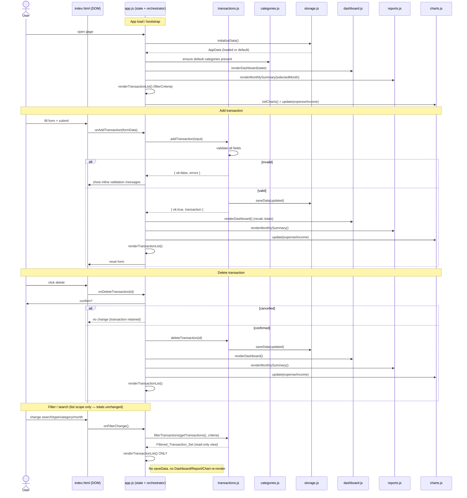
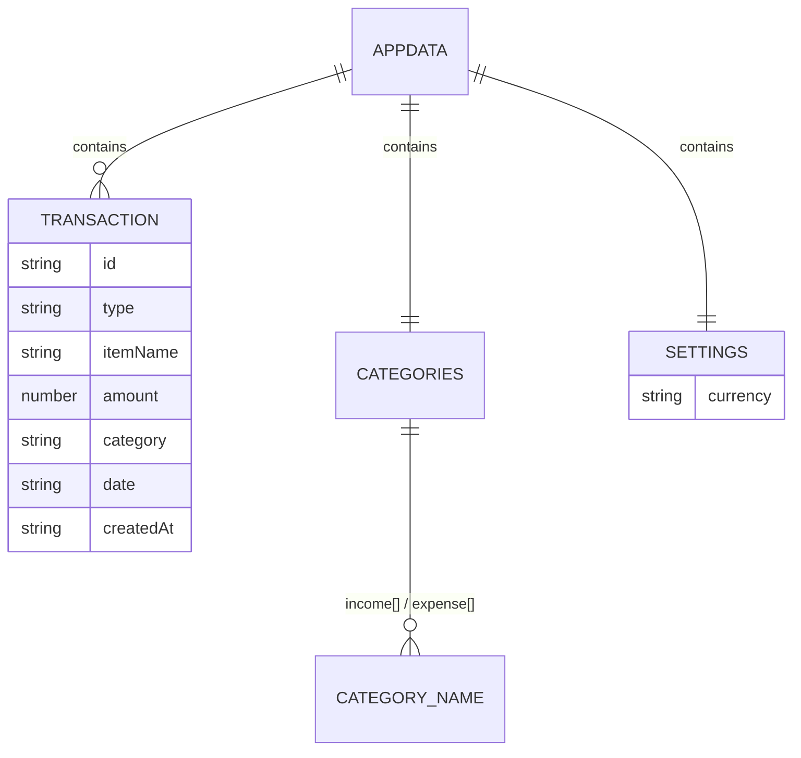

# Design Document: Personal Finance Tracker (v1)

## Overview

Personal Finance Tracker is a client-side-only web application that records income and expense
transactions, tracks balance, categorizes transactions, analyzes spending and income by category,
and produces monthly summaries. It runs entirely in the browser with no backend, persists all data
in `localStorage`, and is deployable as a static site (e.g., GitHub Pages).

This design realizes all 17 requirements using only HTML5, CSS3, Vanilla JavaScript (ES modules),
the Local Storage API, and Chart.js (loaded from a CDN). There is no framework, no backend, no
build step, and no automated test framework in v1. After the initial load, the app works offline;
the only permitted network dependency is the Chart.js CDN script, which never receives financial
data (Req 14.4).

### Design Goals and Guiding Constraints

- **Strict layering** (per steering `structure.md`): UI → business logic → storage. UI modules never
  touch `localStorage`; only `storage.js` does (Req 10.2, 13.5).
- **Single source of truth for money math**: `Total_Balance = Total_Income − Total_Expense` computed
  in exactly one place and reused everywhere (Req 1.5, 2.12, no-duplication rule).
- **Read-only filtering**: the Transaction_List filter/search is a pure view over stored data and
  MUST NOT change Dashboard totals or the Monthly_Summary (Req 4.12, 4.14). This is the most
  safety-critical consistency rule in the design and is treated explicitly below.
- **Two independent scopes**: *reporting scope* (`Selected_Month`, drives Dashboard/Monthly Summary/
  charts) and *transaction-list filter scope* (`Filter_Criteria`, drives only the list). They never
  read from or write to each other.
- **Currency isolation (configurable single-currency)**: all currency formatting flows through one
  `Currency_Formatter` in `utils.js`, parameterized by **currency AND locale** via `Intl.NumberFormat`
  (Req 9.3, 9.5). The app uses a single user-`Selected_Currency` chosen from the `Supported_Currencies`
  set (USD, EUR, GBP, IDR, JPY, CNY, SGD, AUD, CAD, CHF, MYR, THB, INR, KRW), defaulting to **IDR**.
  The formatter MUST NOT hard-code the Indonesian locale (Req 9.4). Changing the Selected_Currency is a
  **display-only** concern — no exchange-rate conversion, no per-transaction currency; stored amounts
  remain plain numbers and are never mutated (Req 9.7, 9.8, 18.6, 18.7).
- **Future-ready storage**: persistence sits behind a `StorageProvider` abstraction so a cloud
  provider can be swapped in later without changing business logic or UI (Req 13).
- **Safety**: no `eval`; user-provided text (item names, category names) is rendered with
  `textContent` / safe DOM APIs, never string-interpolated `innerHTML` (Req 15, general security).

### Deviation from Steering (Intentional)

Steering `structure.md` recommends `src/js/` and `src/css/`. Per the explicit user instruction, this
design uses **top-level `js/` and `css/`** directories instead. This is a deliberate, documented
deviation for simpler static hosting; all layering and module-responsibility principles from steering
are preserved unchanged. The `reports.js` and `charts.js` modules are split (steering listed both),
and a `categories.js` module is added (steering implied category logic could live with transactions,
but Req 8 warrants its own module).

---

## Architecture

### High-Level Layering

```
                         index.html  (semantic HTML shell + <script type="module" src="js/app.js">)
                                        |
        ┌───────────────────────────────┴───────────────────────────────┐
        |                          UI / RENDER LAYER                       |
        |   dashboard.js      reports.js      charts.js   (+ app.js glue)  |
        └───────────────────────────────┬───────────────────────────────┘
                                         |  (reads computed values, requests actions)
        ┌───────────────────────────────┴───────────────────────────────┐
        |                        BUSINESS LOGIC LAYER                      |
        |     transactions.js         categories.js        (utils.js)      |
        └───────────────────────────────┬───────────────────────────────┘
                                         |  (loadData / saveData only)
        ┌───────────────────────────────┴───────────────────────────────┐
        |                          STORAGE LAYER                           |
        |     storage.js  →  StorageProvider (LocalStorageProvider)        |
        └───────────────────────────────┬───────────────────────────────┘
                                         |
                                   localStorage
```

UI calls business logic; business logic calls storage. **Layers are never skipped** (steering
Layering rule). `charts.js` uses Chart.js; `utils.js` is a leaf dependency usable by any layer for
pure helpers (id, dates, formatting, validation).

### Module Responsibilities

Every module and its single responsibility:

| Module | Layer | Responsibility |
|---|---|---|
| `index.html` | Shell | Semantic HTML structure for all sections; loads `css/styles.css` and `js/app.js` (module) and the Chart.js CDN script. Contains no business logic. |
| `css/styles.css` | Presentation | Mobile-first responsive styling; layout, balance cards, forms, list, category manager, chart containers; income/expense visual distinction (Req 3.2); accessible contrast (Req 15.4). |
| `js/app.js` | UI glue / entry point | Bootstraps the app: calls `storage.initializeData()`, wires DOM event listeners, holds the lightweight **app state** (`selectedMonth`, `filterCriteria`), and orchestrates re-renders after every state change. The only place that knows about all UI modules. Also **wires the Settings Currency UI**: on currency change it persists the Selected_Currency through `storage.js` and re-renders every currency-formatted view (dashboard, monthly summary, transaction list, chart tooltips/labels). |
| `js/storage.js` | Storage | The ONLY module that touches `localStorage`. Owns the versioned `Storage_Schema`, `loadData/saveData/clearData/initializeData`, corruption recovery, and the `StorageProvider` abstraction. Owns `settings.currency` (the persisted `Selected_Currency`): it is read and written only here, with a default-to-IDR fallback when absent/invalid (Req 10.2, 18.2, 18.3, 18.4). |
| `js/transactions.js` | Business logic | Transaction CRUD and math: `addTransaction`, `deleteTransaction`, `getTransactions`, `getTransactionsByMonth`, `calculateTotals`, plus the pure `filterTransactions` view function. |
| `js/categories.js` | Business logic | Category rules: defaults + custom, `getCategories`, `addCategory`, `deleteCategory`, `validateCategory`; duplicate-name prevention, type separation, in-use deletion guard. |
| `js/dashboard.js` | UI / render | Renders Total_Balance, Total_Income, Total_Expense, transaction count, Selected_Month, and recent transactions. Renders empty states. Reads computed values from business logic; never computes money math itself. |
| `js/reports.js` | UI / render | Renders the Monthly_Summary for the Selected_Month: monthly income/expense/net balance, monthly transaction count, expense-by-category and income-by-category breakdowns. |
| `js/charts.js` | UI / render (Chart.js) | Owns all Chart.js instances (expense-by-category and income-by-category). Exposes `updateExpenseChart`/`updateIncomeChart`; correctly destroys/updates instances to prevent duplicates and leaks (Req 16.2). No other module manipulates chart objects. |
| `js/utils.js` | Shared leaf | Pure helpers: `formatCurrency(amount, currency, locale)` (Currency_Formatter) built on `Intl.NumberFormat` with **no hard-coded locale** (Req 9.3, 9.4), the `Supported_Currencies` structure (ISO 4217 code → default locale/label), `generateId`, date helpers (`isValidDate`, `getMonthKey`, `isInMonth`), `escape/text-safe` helpers, and input validators. No DOM state, no storage. |
| `assets/` | Static | Icons/images if any. No logic. |

### Two-Scope Model (Critical)

The design defines **two completely independent scoping mechanisms** that must never interfere:

1. **Reporting scope — `Selected_Month`** (app state): drives the Dashboard month label, the
   Monthly_Summary (Req 5), and the charts' reported scope (Req 6.5). Changing it recomputes
   month-scoped reports.
2. **Transaction-list filter scope — `Filter_Criteria`** (app state): `{ searchTerm, type, category,
   month }`, drives ONLY which rows appear in the Transaction_List (Req 4).

`calculateTotals()` and the Monthly_Summary functions read from the **full stored transaction set**
(or the `Selected_Month` slice of it), and **never** read `Filter_Criteria`. `filterTransactions()`
is a pure function that returns a subset for display and **never** writes back or mutates storage.
This structural separation is what guarantees Req 4.12 and 4.14.

---

## Components and Interfaces

Signatures are described as contracts (types are documented, not enforced by TypeScript). All
functions in business logic are synchronous and pure or storage-mediated; `StorageProvider` methods
are defined `async` to keep the future cloud provider swappable.

### `utils.js` — Shared helpers (Currency_Formatter lives here)

```js
// Currency_Formatter (Req 9). Isolated; only place currency strings are produced.
// Parameterized by BOTH currency (ISO 4217) and locale — MUST NOT hard-code 'id-ID' (Req 9.4).
// Uses Intl.NumberFormat(locale, { style: "currency", currency }) internally, e.g.:
//   formatCurrency(1500,    "USD", "en-US") -> "$1,500"
//   formatCurrency(1500,    "EUR", "de-DE") -> "1.500 €"
//   formatCurrency(1500000, "IDR", "id-ID") -> "Rp 1.500.000"
// Backward-safe defaults keep existing callers working: default currency "IDR", and a sensible
// default locale resolved from SUPPORTED_CURRENCIES (IDR -> "id-ID").
formatCurrency(amount: number, currency: string, locale: string): string

// Supported_Currencies (Req 9.1). Fixed ISO 4217 set → default locale (+ optional label). Lives in
// utils (or a small currencies helper) so both the Currency_Setting UI and the formatter share one
// source of truth. Callers with only a currency code resolve its default locale from this map.
const SUPPORTED_CURRENCIES = {
  USD: { locale: "en-US", label: "US Dollar" },
  EUR: { locale: "de-DE", label: "Euro" },
  GBP: { locale: "en-GB", label: "British Pound" },
  IDR: { locale: "id-ID", label: "Indonesian Rupiah" }, // default Selected_Currency (Req 9.2)
  JPY: { locale: "ja-JP", label: "Japanese Yen" },
  CNY: { locale: "zh-CN", label: "Chinese Yuan" },
  SGD: { locale: "en-SG", label: "Singapore Dollar" },
  AUD: { locale: "en-AU", label: "Australian Dollar" },
  CAD: { locale: "en-CA", label: "Canadian Dollar" },
  CHF: { locale: "de-CH", label: "Swiss Franc" },
  MYR: { locale: "ms-MY", label: "Malaysian Ringgit" },
  THB: { locale: "th-TH", label: "Thai Baht" },
  INR: { locale: "en-IN", label: "Indian Rupee" },
  KRW: { locale: "ko-KR", label: "South Korean Won" }
}

generateId(): string                 // unique transaction/category id (e.g., crypto.randomUUID())
isValidDate(dateStr: string): boolean // true only for a real calendar date (Req 2.8)
getMonthKey(dateStr: string): string  // "YYYY-MM" for grouping/month comparison
isInMonth(dateStr: string, monthKey: string): boolean
isBlank(str: string): boolean          // true if empty or whitespace-only (Req 2.5)
safeText(node: HTMLElement, value: string): void // sets node.textContent (never innerHTML)
```

The `formatCurrency` signature accepts both a `currency` (ISO 4217, default `"IDR"`) and a `locale`,
delegating to `Intl.NumberFormat(locale, { style: "currency", currency })`. It **must not** hard-code
`id-ID`; when a caller supplies only a currency code, the default locale is resolved from
`SUPPORTED_CURRENCIES`. This isolates all currency presentation in one place so the Selected_Currency
can change app-wide without touching business logic or storage (Req 9.4, 9.5, 9.6). Callers pass the
numeric amount plus the active Selected_Currency (and its locale).

### `storage.js` — Storage layer + provider abstraction

```js
// Schema constant
const STORAGE_KEY = "financeTrackerData";
const SCHEMA_VERSION = 1;

// Public API used by business logic (never by UI directly):
initializeData(): AppData      // load if present & valid; else create+persist default schema (Req 10.4/10.5/10.6)
loadData(): AppData            // read + validate; on corruption returns a valid default (Req 10.6)
saveData(data: AppData): void  // validate then persist whole schema (Req 10.1/10.3)
clearData(): void              // reset to default schema (used by tests/manual reset)

// Selected_Currency accessors — the ONLY place settings.currency is read/written (Req 10.2, 18.2–18.4).
// These may be thin wrappers over loadData/saveData; the key point is that no other module touches
// settings.currency directly.
getSettings(): { currency: string }   // returns persisted settings (part of AppData)
getCurrency(): string                  // returns settings.currency, or "IDR" if absent/invalid (Req 18.3, 18.4)
setCurrency(code: string): void        // validate code ∈ Supported_Currencies, persist settings.currency (Req 18.2)

// Internal validation
isValidSchema(obj: unknown): boolean
defaultData(): AppData         // { version, transactions: [], categories: {...defaults}, settings }
```

`getCurrency()` reads `settings.currency` from the loaded schema and applies the **default-to-IDR**
fallback whenever the stored value is absent or not a member of `Supported_Currencies` (Req 18.4).
`setCurrency(code)` validates the code against `Supported_Currencies` and persists it via `saveData`,
leaving `transactions` untouched (Req 18.6). Settings live inside the single versioned `AppData`, so
these accessors are just a documented, currency-focused facade over `loadData/saveData` — they add no
new storage key and do not bypass the layering rule (Req 10.2).

**StorageProvider abstraction (future-readiness, Req 13):**

```js
// Interface (documented shape). All methods async to allow network-backed providers later.
interface StorageProvider {
  read(): Promise<AppData | null>;
  write(data: AppData): Promise<void>;
  clear(): Promise<void>;
}

class LocalStorageProvider implements StorageProvider { /* wraps window.localStorage — v1 default */ }

// NOT IMPLEMENTED IN v1 — placeholder only, documents the extension point.
class GoogleSheetsProvider implements StorageProvider {
  // Future: authenticate + sync to a Google Sheet. Throws "Not implemented in v1" if constructed.
}
```

`storage.js` selects `LocalStorageProvider` as the active provider. `loadData/saveData` in v1 use the
provider synchronously via `localStorage`; the async provider interface is the seam a future backend
plugs into. Business logic and UI depend only on `initializeData/loadData/saveData`, never on the
provider class, so swapping providers requires no changes above the storage layer (Req 13.5).

### `transactions.js` — Transaction business logic

```js
// Creation & deletion (persist via storage.js):
addTransaction(input: TransactionInput): { ok: true, transaction: Transaction }
                                        | { ok: false, errors: ValidationError[] }
  // Validates all fields (Req 2.4–2.8). On success builds a Transaction with id/createdAt,
  // appends to data.transactions, calls storage.saveData (Req 2.9–2.11), returns it.

deleteTransaction(id: string): { ok: boolean }
  // Removes the transaction with id, persists updated set (Req 3.5, 3.6). No-op if id absent.

// Reads:
getTransactions(): Transaction[]                     // all stored, unmodified (Req 3.1)
getTransactionsByMonth(monthKey: string): Transaction[] // date within month (Req 5.2)

// Money math — SINGLE source of truth (Req 1.5):
calculateTotals(transactions = getTransactions()): {
  totalIncome: number,   // sum(amount) where type === "income"
  totalExpense: number,  // sum(amount) where type === "expense"
  balance: number,       // totalIncome - totalExpense
  count: number
}
  // Passing a month slice yields Net_Balance for that month (Req 5.5).

// Read-only VIEW for the Transaction_List (Req 4). Pure; no storage writes, no mutation:
filterTransactions(transactions: Transaction[], criteria: FilterCriteria): Transaction[]
  // Applies searchTerm (case-insensitive substring on itemName), type (all/income/expense),
  // category, and month as a logical AND (Req 4.2–4.8). Returns a NEW array (Req 4.14).

// Category totals used by reports/charts:
categoryTotals(transactions: Transaction[], type: "income"|"expense"): Map<string, number>
  // Sums amount grouped by category; callers drop zero-total categories (Req 6.2, 7.3).
```

### `categories.js` — Category business logic

```js
getCategories(type: "income"|"expense"): string[]
  // Default_Categories for the type merged with persisted Custom_Categories (Req 8.4).

addCategory(name: string, type: "income"|"expense"):
  { ok: true } | { ok: false, error: "duplicate" | "invalid" }
  // Rejects blank names and duplicates within the same type (Req 8.2); persists on success (Req 8.3).

deleteCategory(name: string, type: "income"|"expense"):
  { ok: true } | { ok: false, error: "in-use" | "default" }
  // Guard: refuse if any transaction references it (Req 8.7). Never deletes transactions (Req 8.8).
  // Only custom categories are deletable. Persists on success (Req 8.6).

validateCategory(name: string, type: "income"|"expense"):
  { ok: boolean, error?: "duplicate" | "invalid" }

isCategoryInUse(name: string, type: "income"|"expense"): boolean
```

### `dashboard.js` — Dashboard render

```js
renderDashboard(state): void
  // Reads calculateTotals() over all transactions; renders balance/income/expense/count,
  // Selected_Month label, and recent transactions (newest→oldest by date, Req 1.4).
  // Formats every money value via utils.formatCurrency using state.selectedCurrency (+ its resolved
  // locale) (Req 1.8, 9.6). Renders global Empty_State
  // "No transactions yet. Add your first income or expense." when none exist (Req 11.1).
renderRecentTransactions(transactions): void
```

### `reports.js` — Monthly summary render

```js
renderMonthlySummary(monthKey: string, currency: string): void
  // Uses getTransactionsByMonth(monthKey) + calculateTotals() to show monthly income, expense,
  // Net_Balance, and monthly transaction count (Req 5.3–5.6). Renders expense-by-category and
  // income-by-category breakdowns (Req 5.7, 5.8) formatted via formatCurrency with the
  // Selected_Currency (+ its resolved locale) (Req 7.4, 9.6).
```

### `charts.js` — Chart.js integration

```js
initCharts(): void                       // create chart <canvas> contexts once
// Charts receive a formatting callback so currency appears in tooltips/labels via the single
// Currency_Formatter (Req 9.6). The callback closes over the Selected_Currency (+ locale), e.g.
// (amount) => utils.formatCurrency(amount, currency, locale).
updateExpenseChart(categoryTotals: Map, formatMoney: (n: number) => string): void  // expense-by-category (Req 6)
updateIncomeChart(categoryTotals: Map, formatMoney: (n: number) => string): void   // income-by-category (Req 7)
destroyCharts(): void
```

`charts.js` holds module-level references to each `Chart` instance. On update it **destroys the
existing instance (or calls `chart.update()` with new data) before creating a new one**, preventing
duplicate/leaking charts (Req 16.2). When the reported scope has no expense/income transactions, it
shows the container's Empty_State instead of rendering a broken chart (Req 6.7, 7.7). Each chart is
paired with an accessible text description of its data (Req 15.6). No unrelated module touches these
instances.

### `app.js` — Entry point and app state

```js
// Lightweight app state (the only mutable shared state):
const state = {
  selectedMonth: getMonthKey(today),   // reporting scope
  selectedCurrency: storage.getCurrency(), // Selected_Currency (default IDR) → drives all formatting
  filterCriteria: { searchTerm: "", type: "all", category: "", month: "" } // list scope
};

bootstrap(): void        // storage.initializeData(); categories defaults; wire events; renderAll()
renderAll(): void        // dashboard + reports + charts + transaction list, for current state
renderTransactionList(): void  // applies filterTransactions() over getTransactions() (list scope only)
onAddTransaction(formData): void   // validate→add→renderAll (reporting views) + refresh list
onDeleteTransaction(id): void      // confirm→delete→renderAll
onFilterChange(): void             // update state.filterCriteria → renderTransactionList ONLY
onSelectedMonthChange(month): void // update state.selectedMonth → reports + charts (NOT list)
onCurrencyChange(code): void       // Settings Currency UI (Req 18.5): storage.setCurrency(code),
                                   // update state.selectedCurrency, then re-render every
                                   // currency-formatted surface — dashboard totals/Total_Balance,
                                   // monthly summary, transaction list, and chart tooltips/labels.
                                   // Display-only: never touches stored transaction amounts (Req 18.6).
```

At bootstrap, `app.js` reads the persisted Selected_Currency via `storage.getCurrency()` (default-to-IDR
per Req 18.3/18.4) and holds it in app state (`selectedCurrency`) so render functions can pass it — with
its resolved locale — to `utils.formatCurrency`. `onCurrencyChange` is a **reporting-style re-render**:
like a month change it refreshes the currency-formatted views without writing any transaction data.

`app.js` is the single orchestrator implementing the render/notify pattern described in State
Management below.

---

## UI Flow and State Management

### State Management Pattern

The app uses a **lightweight app-state + explicit re-render** pattern (no framework, no reactive
library). `app.js` owns the only mutable shared state:

```js
state = {
  selectedMonth: "YYYY-MM",   // reporting scope → Dashboard month, Monthly_Summary, charts
  filterCriteria: { searchTerm, type, category, month } // list scope → Transaction_List only
}
```

- **Business logic** (`transactions.js`, `categories.js`) is stateless beyond what it reads/writes
  through `storage.js`; it computes values and returns results. It knows nothing about the DOM.
- **UI modules** (`dashboard.js`, `reports.js`, `charts.js`) are pure render functions: given current
  data/state, they produce DOM. They hold no business state.
- **`app.js`** is the notifier/orchestrator. On any user action it (1) calls business logic to
  mutate/read data, (2) updates `state` if needed, then (3) calls the relevant render functions.
  This keeps business logic separate from UI and storage per steering layering.

Two re-render paths, matching the two scopes, keep the consistency rule structural:
- **Reporting-affecting actions** (add, delete, month change) → `renderDashboard`, `renderMonthlySummary`,
  chart updates.
- **Filter changes** → `renderTransactionList` **only**. Filter changes never call the reporting
  renderers and never call `saveData`, so totals and the Monthly_Summary cannot move (Req 4.12, 4.14).

To satisfy performance (Req 16.2, 16.4), re-renders update only affected sections and charts are
updated via `charts.update`/destroy-then-create rather than rebuilt wholesale.

### Complete Interaction Flow (Mermaid)



---

## Data Models

### Transaction

```js
{
  id:        string,   // unique, from utils.generateId()
  type:      "income" | "expense",   // Transaction_Type (Req 2.2)
  itemName:  string,   // non-blank (Req 2.5)
  amount:    number,   // > 0 (Req 2.6)
  category:  string,   // must exist for the type at creation time (Req 2.7)
  date:      string,   // "YYYY-MM-DD", a valid calendar date (Req 2.8)
  createdAt: string    // ISO timestamp set at creation (Req 2.9)
}
```

### Storage Schema (`AppData`) — persisted under key `financeTrackerData`

```js
{
  version: 1,                       // SCHEMA_VERSION (Req 10.3, 13.1)
  transactions: [ /* Transaction */ ],
  categories: {
    income:  [ "Salary", "Freelance", "Business", "Investment", "Gift", "Other", /* + custom */ ],
    expense: [ "Food", "Transport", "Fun", "Bills", "Shopping", "Health", "Other", /* + custom */ ]
  },
  settings: { currency: "IDR" }    // Selected_Currency — ISO 4217 code, default "IDR" (Req 9.2, 18.2)
}
```

`settings.currency` is the persisted **Selected_Currency**: a display setting only. It holds an ISO 4217
code from `Supported_Currencies` (default `"IDR"`, applied as a fallback when absent or invalid — Req
18.4). It is read/written exclusively through `storage.js`. Transaction `amount` values remain plain
numbers with **no currency embedded per transaction** and are never converted; changing `settings.currency`
changes formatting only, never stored amounts (Req 9.7, 9.8, 18.6, 18.7).

The schema stores both default and custom categories per type. (Alternatively defaults are constants
and only custom names are persisted; either is compatible — the persisted structure above is the
canonical v1 shape and keeps `getCategories` a simple read.) The single versioned schema is the
enabler for future backup/sync (Req 13.1).

### Category Structure

Categories are grouped by `Transaction_Type` (`income` vs `expense`) — the same name may exist in
both groups independently (Req 8: type separation, per-type duplicate check).

### FilterCriteria (app state, not persisted)

```js
{
  searchTerm: string,                 // case-insensitive substring on itemName (Req 4.2)
  type:       "all"|"income"|"expense",
  category:   string,                 // "" = no category filter
  month:      string                  // "" = no month filter, else "YYYY-MM"
}
```

### Entity Relationship (Mermaid)



---

## Correctness Properties

*A property is a characteristic or behavior that should hold true across all valid executions of a
system — essentially, a formal statement about what the system should do. Properties serve as the
bridge between human-readable specifications and machine-verifiable correctness guarantees.*

These properties target the **business-logic layer** (`transactions.js`, `categories.js`,
`utils.js`, `storage.js`), which is pure/storage-mediated and has a large input space — the part of
the app where property-based testing adds the most value. UI rendering, layout, accessibility, and
performance criteria are validated by example and manual tests (see Testing Strategy).

### Property 1: Balance is income minus expense

*For any* set of transactions, `calculateTotals` SHALL return `balance === totalIncome − totalExpense`,
where `totalIncome` is the sum of amounts of `income` transactions and `totalExpense` is the sum of
amounts of `expense` transactions.

**Validates: Requirements 1.5**

### Property 2: Adding or deleting a transaction shifts totals by its signed contribution

*For any* prior state and *any* valid transaction, adding it changes `totalIncome`/`totalExpense` by
exactly its amount (on the matching side) and changes `balance` by `+amount` for income or `−amount`
for expense; deleting an existing transaction applies the exact inverse change.

**Validates: Requirements 1.6, 1.7, 2.12, 3.7**

### Property 3: Input validation accepts exactly the valid transactions

*For any* candidate transaction input, `addTransaction` SHALL succeed if and only if the type is
`income` or `expense`, the item name is not blank/whitespace-only, the amount is a number greater
than 0, a category is selected, and the date is a valid calendar date; otherwise it SHALL be rejected
with a validation error and no state change.

**Validates: Requirements 2.4, 2.5, 2.6, 2.7, 2.8**

### Property 4: A created transaction is well-formed

*For any* valid input, the resulting Transaction SHALL contain all of `id`, `type`, `itemName`,
`amount`, `category`, `date`, and `createdAt`, with a unique `id`.

**Validates: Requirements 2.9**

### Property 5: Persistence round-trip preserves transactions

*For any* sequence of valid transactions added through `addTransaction`, reloading via
`storage.loadData()` SHALL return a transaction set equal in content to the added set (a round-trip:
`load(save(x)) == x`).

**Validates: Requirements 2.11, 10.1, 10.7**

### Property 6: Filtering returns exactly the matching transactions (AND semantics)

*For any* transaction set and *any* `Filter_Criteria`, `filterTransactions` SHALL return every stored
transaction that satisfies all active criteria together — case-insensitive substring match on item
name, `type` (`all` matches both), category equality, and month membership — and no transaction that
fails any active criterion (membership holds in both directions).

**Validates: Requirements 4.2, 4.3, 4.4, 4.5, 4.6, 4.7, 4.8**

### Property 7: Clearing filters yields the full transaction set

*For any* transaction set, applying the default `Filter_Criteria` (empty search, type `all`, no
category, default month) SHALL return all stored transactions unchanged.

**Validates: Requirements 4.10, 4.11**

### Property 8: Filtering is read-only and independent of totals and the monthly summary

*For any* transaction set and *any* `Filter_Criteria`, the values of `calculateTotals` (Total_Balance,
Total_Income, Total_Expense) and the Monthly_Summary computed before applying the filter SHALL equal
those computed after, and the stored transactions SHALL be unchanged (same items, same order, no
mutation, deletion, or reordering). `filterTransactions` SHALL return a new array without mutating its
input.

**Validates: Requirements 4.12, 4.14**

### Property 9: Monthly summary is scoped exactly to the selected month

*For any* transaction set and *any* selected month, the Monthly_Summary income, expense, and
Net_Balance SHALL equal `calculateTotals` over exactly the transactions whose `date` falls within that
month, and the monthly transaction count SHALL equal the size of that month's slice.

**Validates: Requirements 5.2, 5.3, 5.4, 5.5, 5.6**

### Property 10: Chart category breakdowns exclude zero-total categories

*For any* transaction set, the category-total map supplied to the expense chart and the income chart
SHALL contain only categories whose total in the reported scope is greater than 0.

**Validates: Requirements 6.2, 7.3**

### Property 11: Duplicate category creation is rejected per type

*For any* existing category set, `addCategory(name, type)` SHALL be rejected when a category with the
same name already exists for the same `type`, and SHALL succeed for a unique valid name (names in
different types are independent).

**Validates: Requirements 8.2**

### Property 12: In-use custom categories cannot be deleted

*For any* transaction set, if at least one transaction references category `C` of a given type, then
`deleteCategory(C, type)` SHALL be refused with an in-use error; a custom category referenced by no
transaction SHALL be deletable.

**Validates: Requirements 8.6, 8.7**

### Property 13: Deleting a category never deletes transactions

*For any* transaction set and *any* category-deletion attempt (whether allowed or refused), the stored
transaction set SHALL remain unchanged.

**Validates: Requirements 8.8**

### Property 14: Currency formatting matches Intl for the given currency and locale

*For any* non-negative amount and *any* member of `Supported_Currencies` paired with its associated
locale, `formatCurrency(amount, currency, locale)` SHALL produce the same currency string that
`Intl.NumberFormat(locale, { style: "currency", currency })` produces for that amount (modulo the
documented normalization), and SHALL NOT depend on any hard-coded Indonesian locale.

**Validates: Requirements 9.2, 9.3, 9.4**

### Property 15: Corrupted or missing storage yields a valid default state

*For any* stored value that is missing, unreadable, or non-conforming to the `Storage_Schema`,
`loadData` SHALL return a valid default `AppData` and SHALL NOT throw.

**Validates: Requirements 10.5, 10.6**

### Property 16: Changing the Selected_Currency never mutates stored amounts

*For any* transaction set and *any* two members of `Supported_Currencies`, changing the Selected_Currency
from one to the other (via `storage.setCurrency`) SHALL leave every stored transaction `amount` — and the
stored transaction set as a whole — unchanged, altering only the persisted `settings.currency` value.

**Validates: Requirements 9.7, 9.8, 18.6**

---

## Error Handling

All error handling enforces the invariant: **invalid financial data never enters application state.**

| Error condition | Where handled | Behavior |
|---|---|---|
| No Transaction_Type selected | `transactions.addTransaction` validation | Reject; message "Transaction type is required" (Req 2.4). |
| Empty / whitespace-only item name | `utils.isBlank` + validation | Reject; message "Item name is required" (Req 2.5). |
| Amount not a number > 0 | validation (`Number` parse + range) | Reject; message "Amount must be greater than 0" (Req 2.6). |
| No Category selected | validation | Reject; message "Category is required" (Req 2.7). |
| Missing / invalid calendar date | `utils.isValidDate` | Reject; message "A valid date is required" (Req 2.8). |
| Invalid Transaction_Type value | validation (whitelist `income`/`expense`) | Reject; never persisted (Req 2.2). |
| Duplicate category name (same type) | `categories.validateCategory` | Reject; message "A category with that name already exists" (Req 8.2). |
| Delete category in use | `categories.isCategoryInUse` guard | Refuse; explain "Category is in use" (Req 8.7); transactions untouched (Req 8.8). |
| Corrupted / missing localStorage | `storage.loadData` try/catch + `isValidSchema` | Fall back to `defaultData()`; app continues without unhandled error (Req 10.6). |
| Missing data on first run | `storage.initializeData` | Create and persist empty valid schema (Req 10.5). |

Validation runs in the business-logic layer **before** any write, so the storage layer only ever
persists validated data. All validation failures surface as inline, labelled messages in the relevant
form (accessible per Req 15.2). No exception is allowed to leave the app in a broken state.

---

## Security

- **No `eval()`** and no dynamic code execution anywhere in the app.
- **No unsafe `innerHTML` for user input.** User-provided values (item names, custom category names)
  are rendered exclusively via `textContent` / `document.createElement` / `utils.safeText`, never via
  string-interpolated HTML. This prevents stored-XSS from a crafted item/category name.
- **No data exfiltration.** Financial data is written only to `localStorage`; the only outbound
  request is the Chart.js CDN `<script>`, which carries no financial data (Req 14.2, 14.4).
- **Privacy notice.** A clear statement ("Your data is stored only in your browser and is never sent
  to any server") is displayed in the footer/privacy section (Req 14.3).
- **Input validation** at the business-logic boundary doubles as a security control against malformed
  or oversized input entering state.

---

## Responsive Layout

Mobile-first CSS (single-column base, progressive enhancement to multi-column at wider breakpoints).

Sections, in DOM/reading order:
1. **Header** — app title.
2. **Balance cards** — Total_Balance, Total_Income, Total_Expense, transaction count.
3. **Add transaction form** — type, item name, amount, category (type-dependent), date.
4. **Monthly selector** — chooses `Selected_Month` (reporting scope).
5. **Charts** — expense-by-category and income-by-category, each with accessible text description.
6. **Transaction list** — filter/search controls (list scope) + rows + empty/filtered-empty states.
7. **Category management** — list custom categories, add, delete (with in-use guard).
8. **Settings** — the Currency_Setting: a labelled `<select>` of `Supported_Currencies` for choosing the
   single Selected_Currency (Req 18.1). Selecting a currency persists it via `storage.setCurrency` and
   triggers a re-render of the currency-formatted surfaces (Req 18.2, 18.5).
9. **Footer / privacy info** — privacy statement.

**Currency-change re-render path (Req 18.5).** Changing the Selected_Currency is **display-only** and
behaves like a reporting-scope refresh: `app.onCurrencyChange(code)` persists the value through
`storage.setCurrency`, updates `state.selectedCurrency`, then re-renders the currency-formatted surfaces
— Dashboard totals/Total_Balance, the Monthly_Summary, the Transaction_List rows, and chart
tooltips/labels — passing the new currency (and its resolved locale) to `utils.formatCurrency`. It does
**not** call the transaction-mutating paths and never touches stored amounts (Req 9.7, 9.8, 18.6, 18.7).

Layout rules:
- **Mobile**: sections stack vertically; controls are touch-friendly (adequate hit targets);
  **no horizontal scrolling** for primary content/controls (Req 12.2, 12.3).
- **Tablet/Desktop**: balance cards and charts flow into a multi-column grid where space allows
  (Req 12.1) using CSS Grid/Flexbox with `minmax`/`auto-fit`.
- Income vs expense amounts get distinct visual treatment (e.g., color + sign), meeting readable
  contrast (Req 3.2, 15.4).
- Semantic HTML (`<header>`, `<main>`, `<section>`, `<form>`, `<label>`, `<button>`), labelled inputs,
  keyboard-operable controls, accessible button labels (Req 15.1–15.5).

---

## Testing Strategy

### Approach

- **Property-based tests** validate the universal invariants of the business-logic layer (Properties
  1–16 above). These target pure functions (`calculateTotals`, `filterTransactions`,
  `categoryTotals`, `formatCurrency`, validators) and storage-mediated round-trips.
- **Example / unit tests** validate specific behaviors and edge cases (empty-state messages,
  filtered-empty message, income/expense styling hooks, recent-transaction ordering).
- **Manual tests** validate UI, layout, accessibility, privacy text, and performance.

**Automated test framework is not required for v1** per steering. Where PBT-style invariants are
called out, they are documented as executable specifications that a lightweight harness could check;
if a harness is later added, use a property-based library for the target language (e.g.,
`fast-check` for JS) — **do not hand-roll PBT** — configure **≥ 100 iterations** per property, and tag
each test with a comment in the form **`Feature: personal-finance-tracker, Property {number}:
{property_text}`**, referencing the design property it implements. Each correctness property maps to a
single property-based test.

### Manual Test Cases (v1 acceptance)

| # | Scenario | Expected result | Reqs |
|---|---|---|---|
| 1 | Add income | Balance/income increase; row appears; form resets; persists | 2.9–2.13, 1.6 |
| 2 | Add expense | Balance decreases; expense styled distinctly; persists | 2.x, 3.2 |
| 3 | Delete transaction | Confirm prompt; on confirm removed; totals/summary/charts update | 3.3–3.7 |
| 4 | Calculate balance | Balance always equals income − expense | 1.5 |
| 5 | Monthly filtering (report) | Changing Selected_Month re-scopes summary + charts; list totals unchanged | 5.x |
| 6 | Category analysis | Expense/income charts group by category, zero-totals excluded, empty state when none | 6, 7 |
| 7 | Custom category creation | Unique name accepted; duplicate (same type) rejected; appears in form | 8.1–8.5 |
| 8 | Invalid input | Blank name / amount ≤ 0 / bad date / missing type or category all rejected with messages | 2.4–2.8 |
| 9 | localStorage persistence | Data survives refresh and browser restart | 10.4, 10.7 |
| 10 | Empty state | Fresh app shows "No transactions yet…"; no broken chart | 11.1, 11.2 |
| 11 | Filtered empty state | Filters matching nothing show "No transactions match your filters."; totals unchanged | 4.13, 4.12 |
| 12 | Clear filters | Resets all criteria; shows all transactions | 4.10, 4.11 |
| 13 | Delete in-use category | Refused with "Category is in use"; transactions retained | 8.7, 8.8 |
| 14 | Corrupted storage | Manually corrupt key → app starts clean, no crash | 10.6 |
| 15 | Mobile layout | No horizontal scroll; touch-operable; keyboard navigable | 12, 15 |
| 16 | Privacy notice | Footer states data stays in browser | 14.3 |

### Consistency Regression (highest priority)

A dedicated manual + property check for the critical rule: apply every combination of
search/type/category/month filters and confirm **Dashboard totals and Monthly_Summary values do not
change** and no stored transaction is altered (Req 4.12, 4.14 → Property 8).

---

## Future Extensibility

Designed for, **not built in v1** (Req 13, product/structure steering):

- **`StorageProvider` seam** — `LocalStorageProvider` is the v1 implementation; `GoogleSheetsProvider`
  is a documented placeholder class that is **not implemented** (constructing it is unsupported in v1,
  Req 13.2). All business logic and UI depend only on `initializeData/loadData/saveData`, so a cloud
  backend can be added without changes above the storage layer (Req 13.5).
- **Versioned schema (`version: 1`)** — enables future migrations and backup/sync (CSV export/import,
  JSON backup/restore, Google Sheets) without rewrites (Req 13.1). None of these are implemented in v1
  (Req 13.3, 13.4).
- **`Currency_Formatter` parameterized by currency + locale** — the app now supports a user-selectable
  single Selected_Currency drawn from `Supported_Currencies`, formatted via `Intl.NumberFormat` with a
  per-currency locale; adding another supported currency is a one-line entry in `SUPPORTED_CURRENCIES`
  with no calling-module changes (Req 9.5). **Multi-currency-per-transaction and exchange-rate (FX)
  conversion remain explicitly out of scope** — currency selection is presentation-only (Req 9.7, 18.7).
- **Category model per type** — already supports arbitrary custom categories, ready for richer
  category features.
- The app remains **fully functional on localStorage alone**; no future feature is required for v1 to
  work.
