# Implementation Plan: Personal Finance Tracker (v1)

## Overview

This plan converts the approved design into a series of small, sequential, independently
verifiable coding tasks for a **client-side-only** web application built with HTML5, CSS3,
Vanilla JavaScript (ES modules), the browser `localStorage` API, and Chart.js (loaded from a CDN).

No frameworks (React/Vue/Angular), no backend, no database, no authentication, no build step, and
no dependencies beyond Chart.js are used. Google Sheets synchronization is **out of scope for v1**;
it is only documented as a future extension point (the `GoogleSheetsProvider` placeholder), never
implemented.

Tasks follow the design's strict layering (UI → business logic → storage) and top-level file
structure (`index.html`, `css/styles.css`, `js/*.js`). Each task builds on the previous one and ends
with wiring things together, so no orphaned code is left behind. Where a task validates a design
correctness property, the property is referenced explicitly.

Directory / file structure used throughout:

```
index.html
css/styles.css
js/app.js
js/storage.js
js/transactions.js
js/categories.js
js/dashboard.js
js/reports.js
js/charts.js
js/utils.js
assets/
README.md
.gitignore
```

Each task specifies: Task ID, Objective, Requirements covered, Files, Implementation details,
Acceptance criteria, and Dependencies.

---

## Tasks

The implementation tasks are organized into the phases below. Task IDs and numbering are stable
across the document (dependency graph and coverage matrix reference them directly).

### Phase 1 — Project Foundation

- [x] 1. Project foundation: HTML shell, CSS foundation, JS module scaffolding
  - [x] 1.1 Create the semantic HTML shell and static structure
    - **Objective:** Build the single-page semantic HTML document that hosts all app sections and loads styles, the Chart.js CDN script, and the ES module entry point.
    - **Requirements covered:** 12.1, 14.4, 15.1, 16.1
    - **Files:** `index.html`, `assets/`, `.gitignore`
    - **Implementation details:**
      - Create `index.html` with `<!DOCTYPE html>`, `<meta charset>`, and `<meta name="viewport" content="width=device-width, initial-scale=1">` for responsiveness.
      - Add semantic landmarks in DOM/reading order: `<header>` (app title), `<main>` containing `<section>` elements for balance cards, add-transaction form, monthly selector, charts, transaction list (with filter controls), category management, and a `<footer>` privacy section.
      - Add placeholder containers/IDs for each section so later modules can target them; leave content empty for now.
      - Load Chart.js from a CDN via `<script>` in a way that carries no financial data; load the app via `<script type="module" src="js/app.js"></script>` (no build step).
      - Create an `assets/` directory (add a `.gitkeep` or icon placeholder) and a `.gitignore` (ignore OS/editor cruft like `.DS_Store`, `Thumbs.db`, editor folders; no `node_modules` since there is no build).
    - **Acceptance criteria:**
      - Opening `index.html` directly in a browser renders the empty semantic shell with no console errors and no build step.
      - All primary sections exist as semantic elements with stable IDs/classes for later wiring.
      - Chart.js loads from the CDN; the module script is referenced but need not do anything yet.
    - **Dependencies:** none

  - [x] 1.2 Create the mobile-first CSS foundation
    - **Objective:** Establish base styles, layout scaffolding, and design tokens (colors, spacing, typography) with a mobile-first approach.
    - **Requirements covered:** 12.1, 15.4
    - **Files:** `css/styles.css`, `index.html`
    - **Implementation details:**
      - Create `css/styles.css` and link it from `index.html`.
      - Define CSS custom properties for colors (ensuring readable text/background contrast), spacing, and typography.
      - Establish a mobile-first single-column base layout for the sections defined in 1.1; add container/utility classes only (full responsive breakpoints come in Phase 9).
      - Reset/normalize box sizing and default margins.
    - **Acceptance criteria:**
      - The shell renders as a clean, readable single-column layout on a narrow viewport.
      - Color tokens provide a readable contrast level for text on background.
    - **Dependencies:** 1.1

  - [x] 1.3 Scaffold the ES module structure and app entry point
    - **Objective:** Create all JS module files with documented responsibilities and stub exports, and wire `app.js` as the orchestrator so the module graph loads cleanly.
    - **Requirements covered:** 16.1 (loads without a build step); establishes the layering that supports 10.2, 13.5
    - **Files:** `js/app.js`, `js/storage.js`, `js/transactions.js`, `js/categories.js`, `js/dashboard.js`, `js/reports.js`, `js/charts.js`, `js/utils.js`
    - **Implementation details:**
      - Create each `js/*.js` module with a top-of-file comment stating its single responsibility and layer (per design "Module Responsibilities").
      - Add stub `export` signatures matching the design's Components and Interfaces (e.g., `formatCurrency`, `initializeData`, `addTransaction`, `getCategories`, `renderDashboard`, `renderMonthlySummary`, `initCharts`) that currently return safe defaults / no-ops.
      - In `app.js`, define the app `state` object (`selectedMonth`, `filterCriteria`) and a `bootstrap()` function that runs on load and, for now, only imports the modules and logs readiness.
      - Enforce import direction: UI modules import business logic; business logic imports storage/utils; `utils.js` imports nothing app-specific.
    - **Acceptance criteria:**
      - Loading the page executes `bootstrap()` with no module-resolution or console errors.
      - Each module exists, exports its documented interface stubs, and respects the layering (no UI module imports `storage.js` for `localStorage` access).
    - **Dependencies:** 1.1

---

### Phase 2 — Data and Storage

- [x] 2. Data model and storage layer with recovery and provider abstraction
  - [x] 2.1 Define the data model and utility leaf helpers
    - **Objective:** Implement the pure `utils.js` helpers used across all layers, including the Currency_Formatter and date/validation helpers.
    - **Requirements covered:** 9.1, 9.2, 9.3, 9.4, 9.5
    - **Files:** `js/utils.js`
    - **Implementation details:**
      - Implement `formatCurrency(amount, currency = "IDR")` using `Intl.NumberFormat('id-ID', ...)` to produce strings like `Rp 1.500.000` (period thousands separator, `Rp` symbol); parameterized by currency for future currencies with no caller changes.
      - Implement `generateId()` (e.g., `crypto.randomUUID()`), `isValidDate(dateStr)`, `getMonthKey(dateStr)` (→ `"YYYY-MM"`), `isInMonth(dateStr, monthKey)`, `isBlank(str)`, and `safeText(node, value)` (sets `textContent`, never `innerHTML`).
      - Keep all helpers pure: no DOM state, no storage access.
    - **Acceptance criteria:**
      - `formatCurrency(1500000)` returns `"Rp 1.500.000"`.
      - Currency formatting is defined only here; no other module formats currency.
      - Date/validation helpers behave correctly for valid and invalid inputs.
    - **Dependencies:** 1.3

  - [x] 2.3 Implement the storage layer, schema, and localStorage read/write
    - **Objective:** Implement `storage.js` as the only module touching `localStorage`, owning the single versioned `Storage_Schema` and the `loadData/saveData/clearData/initializeData` API.
    - **Requirements covered:** 10.1, 10.2, 10.3, 10.4, 10.5, 10.7, 13.1
    - **Files:** `js/storage.js`
    - **Implementation details:**
      - Define `STORAGE_KEY = "financeTrackerData"` and `SCHEMA_VERSION = 1`.
      - Implement `defaultData()` returning `{ version: 1, transactions: [], categories: { income: [...], expense: [...] }, settings: { currency: "IDR" } }` with default categories seeded (see 2.4).
      - Implement `initializeData()` (load if present & valid, else create + persist default), `loadData()`, `saveData(data)` (persist whole schema), and `clearData()`.
      - Route ALL `localStorage` reads/writes through this module only.
    - **Acceptance criteria:**
      - On first run with empty storage, an empty valid schema is created and persisted.
      - Adding data then reloading returns the same persisted data (round-trip).
      - No other module accesses `localStorage`.
    - **Dependencies:** 2.1

  - [x] 2.4 Seed default categories in the schema
    - **Objective:** Ensure the default income and expense categories exist in the persisted schema and on first initialization.
    - **Requirements covered:** 8.4 (defaults selectable), supports 2.3, 5.7, 5.8
    - **Files:** `js/storage.js`
    - **Implementation details:**
      - Expense defaults: Food, Transport, Fun, Bills, Shopping, Health, Other.
      - Income defaults: Salary, Freelance, Business, Investment, Gift, Other.
      - Seed these in `defaultData()` and ensure `initializeData()` guarantees defaults are present even for a loaded schema missing them.
    - **Acceptance criteria:**
      - A freshly initialized schema contains exactly the specified default categories per type.
    - **Dependencies:** 2.3

  - [x] 2.5 Implement schema validation and corrupted/missing recovery
    - **Objective:** Make storage resilient so missing, unreadable, or non-conforming data yields a valid default state without throwing.
    - **Requirements covered:** 10.5, 10.6
    - **Files:** `js/storage.js`
    - **Implementation details:**
      - Implement `isValidSchema(obj)` checking the version identifier, `transactions` array, `categories.income`/`categories.expense` arrays, and `settings`.
      - Wrap `loadData()` reads in try/catch (JSON parse failures) and validate with `isValidSchema`; on any failure return `defaultData()` (do not throw).
      - Ensure `initializeData()` on first run creates and persists the empty valid schema.
    - **Acceptance criteria:**
      - Manually corrupting the storage value causes the app to start with a valid default state and continue without an unhandled error.
      - Missing data on first run produces an empty valid schema.
    - **Dependencies:** 2.3

  - [x] 2.7 Implement the StorageProvider abstraction (LocalStorageProvider) and document GoogleSheetsProvider placeholder
    - **Objective:** Introduce the `StorageProvider` seam so a future backend can be swapped in without changing business logic or UI; document (do not implement) `GoogleSheetsProvider`.
    - **Requirements covered:** 13.1, 13.2, 13.5, 14.1, 14.2
    - **Files:** `js/storage.js`
    - **Implementation details:**
      - Define the `StorageProvider` interface (documented shape): `read()`, `write(data)`, `clear()` (async signatures to allow network-backed providers later).
      - Implement `LocalStorageProvider` wrapping `window.localStorage` as the active v1 provider; `loadData/saveData/clearData` use it.
      - Add `GoogleSheetsProvider` as a **placeholder class only** — constructing it throws "Not implemented in v1". No sync logic, no network calls, no auth.
      - Ensure business logic and UI depend only on `initializeData/loadData/saveData`, never on the provider class.
    - **Acceptance criteria:**
      - v1 persistence uses `LocalStorageProvider` and stores data only in the browser.
      - `GoogleSheetsProvider` exists as a documented placeholder and is never used or wired in v1.
      - Swapping providers would require no changes above the storage layer.
    - **Dependencies:** 2.3, 2.5

---

### Phase 3 — Transaction Management

- [x] 3. Transaction business logic and list rendering
  - [x] 3.1 Implement transaction creation, validation, and money math
    - **Objective:** Implement `addTransaction`, the single source of truth `calculateTotals`, and reads in `transactions.js`.
    - **Requirements covered:** 1.5, 2.1, 2.2, 2.4, 2.5, 2.6, 2.7, 2.8, 2.9, 2.10, 2.11
    - **Files:** `js/transactions.js`
    - **Implementation details:**
      - Implement `addTransaction(input)` returning `{ ok: true, transaction }` or `{ ok: false, errors }`. Validate: type is `income`/`expense` (2.2, 2.4), item name non-blank via `isBlank` (2.5), amount is a number > 0 (2.6), category selected (2.7), date valid via `isValidDate` (2.8). On success build a `Transaction` with `id`, `type`, `itemName`, `amount`, `category`, `date`, `createdAt`, append, and persist via `storage.saveData` (2.9–2.11).
      - Implement `getTransactions()` and `calculateTotals(transactions = getTransactions())` returning `{ totalIncome, totalExpense, balance: totalIncome - totalExpense, count }` — the only place money math is computed (1.5).
    - **Acceptance criteria:**
      - Valid input creates and persists a well-formed transaction; invalid input is rejected with a validation error and no state change.
      - `balance === totalIncome - totalExpense` for any transaction set.
    - **Dependencies:** 2.3, 2.1

  - [x] 3.3 Build the add-transaction form UI, validation display, and form reset
    - **Objective:** Wire the transaction form to `addTransaction`, show inline validation, and reset the form on success.
    - **Requirements covered:** 2.1, 2.3, 2.13, 15.2
    - **Files:** `index.html`, `js/app.js`, `js/dashboard.js`
    - **Implementation details:**
      - Add form fields for type, item name, amount, category (type-dependent), and date to `index.html`, each with an associated `<label>`.
      - In `app.js`, implement `onAddTransaction(formData)`: call `addTransaction`, show inline labelled validation messages on failure, and on success reset the form to its empty default state.
      - When the user changes Transaction_Type, present the Category options applicable to that type (uses `getCategories` from Phase 8; use defaults for now).
    - **Acceptance criteria:**
      - Submitting invalid data shows the appropriate inline validation message and does not create a transaction.
      - A successful submission resets the form.
      - Changing type updates the category options.
    - **Dependencies:** 3.1, 1.2

  - [x] 3.4 Render the transaction list with income/expense visual distinction
    - **Objective:** Display all stored transactions with per-row fields and distinct income vs expense styling.
    - **Requirements covered:** 3.1, 3.2, 15.4
    - **Files:** `js/transactions.js`, `js/app.js`, `js/dashboard.js`, `css/styles.css`
    - **Implementation details:**
      - Render each transaction showing item name, amount (formatted via `formatCurrency`), category, type, and date.
      - Apply distinct visual treatment (color + sign) to expense vs income amounts, meeting readable contrast.
      - Render user-provided text with `safeText`/`textContent` (never `innerHTML`).
      - Add `renderTransactionList()` in `app.js` that lists `getTransactions()` for now (filtering added in Phase 6).
    - **Acceptance criteria:**
      - All stored transactions render with all required fields.
      - Expense and income amounts are visually distinct.
    - **Dependencies:** 3.1, 1.2

  - [x] 3.5 Implement delete transaction with confirmation
    - **Objective:** Implement `deleteTransaction` and a confirmation interaction that retains the transaction on cancel and removes + persists on confirm.
    - **Requirements covered:** 3.3, 3.4, 3.5, 3.6
    - **Files:** `js/transactions.js`, `js/app.js`
    - **Implementation details:**
      - Implement `deleteTransaction(id)` removing the matching transaction and persisting the updated set via `storage.saveData` (no-op if id absent).
      - In `app.js`, implement `onDeleteTransaction(id)` that requires a confirmation; on cancel retain unchanged, on confirm delete then re-render the list.
    - **Acceptance criteria:**
      - Deleting prompts for confirmation; cancel keeps the transaction; confirm removes and persists it.
    - **Dependencies:** 3.1, 3.4

---

### Phase 4 — Dashboard

- [x] 4. Dashboard rendering and reactivity
  - [x] 4.1 Render dashboard totals, selected month, count, and recent transactions
    - **Objective:** Implement `renderDashboard` showing balance, income, expense, transaction count, the Selected_Month label, and recent transactions newest→oldest.
    - **Requirements covered:** 1.1, 1.2, 1.4, 1.5, 1.8
    - **Files:** `js/dashboard.js`, `js/app.js`, `index.html`, `css/styles.css`
    - **Implementation details:**
      - Read `calculateTotals()` over all transactions; render Total_Balance, Total_Income, Total_Expense, and count into the balance cards; format every money value via `formatCurrency` (1.8).
      - Display the current `state.selectedMonth` label.
      - Implement `renderRecentTransactions(transactions)` ordering newest→oldest by `date` (1.4).
      - Dashboard reads computed values only; it never computes money math itself.
    - **Acceptance criteria:**
      - Dashboard displays balance/income/expense, month, count, and recent transactions ordered newest→oldest, all money values formatted.
    - **Dependencies:** 3.1, 1.2

  - [x] 4.2 Wire dashboard reactivity to add/delete state changes
    - **Objective:** Ensure the dashboard totals update whenever a transaction is added or deleted.
    - **Requirements covered:** 1.6, 1.7, 2.12
    - **Files:** `js/app.js`
    - **Implementation details:**
      - In `renderAll()`, call `renderDashboard(state)` after add and delete actions so totals reflect the change.
      - Confirm `onAddTransaction` and `onDeleteTransaction` trigger dashboard re-render (reporting scope path).
    - **Acceptance criteria:**
      - Adding a transaction updates displayed balance/income/expense; deleting reverses the change exactly.
    - **Dependencies:** 4.1, 3.3, 3.5
---

### Phase 5 — Monthly Reports

- [ ] 5. Monthly summary with category analysis
  - [x] 5.1 Implement month-scoped reads and category totals in business logic
    - **Objective:** Add `getTransactionsByMonth` and `categoryTotals` to support month-scoped reporting.
    - **Requirements covered:** 5.2
    - **Files:** `js/transactions.js`
    - **Implementation details:**
      - Implement `getTransactionsByMonth(monthKey)` returning transactions whose `date` falls within the month (via `isInMonth`).
      - Implement `categoryTotals(transactions, type)` returning a `Map<category, total>` for the given type; callers drop zero-total categories.
    - **Acceptance criteria:**
      - Month slice contains exactly the transactions within the selected month.
      - `categoryTotals` correctly sums amounts grouped by category per type.
    - **Dependencies:** 3.1

  - [x] 5.2 Build the month selector and wire reporting-scope changes
    - **Objective:** Let the user select a Selected_Month and recompute month-scoped views on change.
    - **Requirements covered:** 5.1, 5.9
    - **Files:** `index.html`, `js/app.js`, `css/styles.css`
    - **Implementation details:**
      - Add a month selector control (labelled) to `index.html`; default to the current month.
      - In `app.js`, implement `onSelectedMonthChange(month)` that updates `state.selectedMonth` and re-renders the Monthly_Summary and charts only (not the transaction list).
    - **Acceptance criteria:**
      - Changing the month recomputes and redisplays the Monthly_Summary for the new month.
    - **Dependencies:** 5.1, 4.1

  - [ ] 5.3 Render monthly totals (income, expense, net, count)
    - **Objective:** Implement `renderMonthlySummary` showing monthly income, expense, Net_Balance, and count for the Selected_Month.
    - **Requirements covered:** 5.3, 5.4, 5.5, 5.6
    - **Files:** `js/reports.js`, `index.html`, `css/styles.css`
    - **Implementation details:**
      - Use `getTransactionsByMonth(monthKey)` + `calculateTotals()` to compute monthly income, expense, `Net_Balance` (income − expense for the month), and the monthly transaction count.
      - Format monetary values via `formatCurrency`.
    - **Acceptance criteria:**
      - Monthly summary shows correct income, expense, net balance, and count scoped to the selected month.
    - **Dependencies:** 5.1, 5.2

  - [x] 5.4 Render expense and income category breakdowns for the month
    - **Objective:** Show expense-by-category and income-by-category breakdowns for the Selected_Month.
    - **Requirements covered:** 5.7, 5.8, 7.2, 7.4
    - **Files:** `js/reports.js`, `css/styles.css`
    - **Implementation details:**
      - Use `categoryTotals(monthSlice, "expense")` and `categoryTotals(monthSlice, "income")`; exclude zero-total categories.
      - For each category with income > 0, display the category name and total income amount (7.2); format all amounts via `formatCurrency` (7.4).
    - **Acceptance criteria:**
      - Expense and income breakdowns list only nonzero categories with formatted totals for the selected month.
    - **Dependencies:** 5.1, 5.3

---

### Phase 6 — Transaction Search and Filters

- [x] 6. Read-only search and filtering over the transaction list
  - [x] 6.1 Implement the pure filterTransactions view function
    - **Objective:** Implement `filterTransactions` applying search, type, category, and month as a logical AND, returning a new array without mutation.
    - **Requirements covered:** 4.2, 4.3, 4.4, 4.5, 4.6, 4.7, 4.8, 4.14
    - **Files:** `js/transactions.js`
    - **Implementation details:**
      - `filterTransactions(transactions, criteria)` applies: case-insensitive substring match on `itemName` (4.2), type `all`/`income`/`expense` (4.3–4.5), category equality (4.6), month membership (4.7), combined as AND (4.8).
      - Return a NEW array; never mutate, reorder, or write back (4.14).
    - **Acceptance criteria:**
      - Returns exactly the transactions satisfying all active criteria; input array is not mutated.
    - **Dependencies:** 3.1

  - [x] 6.3 Build filter/search controls and apply filters to the list only
    - **Objective:** Add search term, type, category, and month filter controls that recompute the list immediately on change — affecting only the Transaction_List.
    - **Requirements covered:** 4.1, 4.9, 4.12
    - **Files:** `index.html`, `js/app.js`, `css/styles.css`
    - **Implementation details:**
      - Add labelled controls: search input, type filter (`all`/`income`/`expense`), category filter, month filter.
      - Implement `onFilterChange()` updating `state.filterCriteria` then calling `renderTransactionList()` ONLY (no `saveData`, no dashboard/report/chart re-render), guaranteeing totals and monthly summary do not move (4.12).
      - `renderTransactionList()` applies `filterTransactions(getTransactions(), state.filterCriteria)`.
    - **Acceptance criteria:**
      - Any filter change updates the list immediately; dashboard totals and monthly summary are unaffected.
    - **Dependencies:** 6.1, 3.4, 4.1

  - [x] 6.4 Implement Clear Filters and the filtered empty state
    - **Objective:** Add a Clear Filters action and render the filtered-empty message when nothing matches.
    - **Requirements covered:** 4.10, 4.11, 4.13
    - **Files:** `index.html`, `js/app.js`
    - **Implementation details:**
      - Add a Clear Filters action resetting search to empty, type to `all`, category to none, and month to default; then display all stored transactions (4.10, 4.11).
      - When transactions exist but none satisfy the active criteria, render the Filtered_Empty_State with the message "No transactions match your filters." in place of the list entries (4.13).
    - **Acceptance criteria:**
      - Clear Filters restores the full list; a non-matching filter shows the exact filtered-empty message.
    - **Dependencies:** 6.3

---

### Phase 7 — Charts

- [ ] 7. Chart.js integration for category analysis
  - [x] 7.1 Integrate Chart.js and initialize chart canvases
    - **Objective:** Set up `charts.js` to own all Chart.js instances and initialize the expense and income chart canvases once.
    - **Requirements covered:** 6.1, 15.6
    - **Files:** `js/charts.js`, `index.html`, `css/styles.css`
    - **Implementation details:**
      - Add `<canvas>` elements (with accessible text descriptions) for the expense-by-category and income-by-category charts in `index.html`.
      - Implement `initCharts()` acquiring contexts once; hold module-level references to each `Chart` instance. No other module manipulates chart objects.
    - **Acceptance criteria:**
      - Both chart canvases initialize once with an accessible text description available for each.
    - **Dependencies:** 1.1, 5.1

  - [ ] 7.2 Implement expense-by-category and income-by-category chart updates
    - **Objective:** Implement `updateExpenseChart` and `updateIncomeChart` grouping amounts by category, excluding zero-total categories.
    - **Requirements covered:** 6.1, 6.2, 7.1, 7.3
    - **Files:** `js/charts.js`, `js/app.js`
    - **Implementation details:**
      - Feed `categoryTotals(scope, "expense")` and `categoryTotals(scope, "income")` (zero-total categories dropped by callers) into the respective charts.
      - Wire chart updates into `renderAll()` for the current reporting scope.
    - **Acceptance criteria:**
      - Expense and income charts show category distributions with zero-total categories excluded.
    - **Dependencies:** 7.1, 5.1


  - [ ] 7.4 Implement chart update/destroy lifecycle and reactivity
    - **Objective:** Manage chart lifecycle so charts update on add/delete/month change without duplicates or leaks.
    - **Requirements covered:** 6.3, 6.4, 6.5, 7.5, 7.6, 16.2
    - **Files:** `js/charts.js`, `js/app.js`
    - **Implementation details:**
      - On update, call `chart.update()` with new data, or destroy the existing instance before recreating; implement `destroyCharts()`.
      - Trigger chart updates from add, delete, and month-change flows; do not recreate unchanged charts.
    - **Acceptance criteria:**
      - Adding/deleting a transaction or changing the month updates charts without creating duplicate instances or leaking memory.
    - **Dependencies:** 7.2, 4.2, 5.2

  - [ ] 7.5 Implement empty chart states
    - **Objective:** Show an empty state instead of a broken/empty chart when there are no expense/income transactions in scope.
    - **Requirements covered:** 6.7, 7.7, 11.2
    - **Files:** `js/charts.js`, `css/styles.css`
    - **Implementation details:**
      - When the reported scope has no expense transactions, show the expense chart container's Empty_State; likewise for income (7.7).
      - Ensure the dashboard never renders a broken/empty chart when there are no transactions (11.2).
    - **Acceptance criteria:**
      - With no expense/income data in scope, an empty state is shown in place of the chart; no broken chart renders.
    - **Dependencies:** 7.2

---

### Phase 8 — Custom Categories

- [ ] 8. Custom category management
  - [ ] 8.1 Implement category business logic (get, add, validate, delete rules)
    - **Objective:** Implement `categories.js` with defaults+custom reads, duplicate-prevented add, and in-use-guarded delete.
    - **Requirements covered:** 8.1, 8.2, 8.3, 8.4, 8.6, 8.7, 8.8
    - **Files:** `js/categories.js`
    - **Implementation details:**
      - `getCategories(type)` merges defaults with persisted custom categories for the type (8.4).
      - `addCategory(name, type)` rejects blank and per-type duplicates (8.2), persists on success (8.3).
      - `validateCategory(name, type)` and `isCategoryInUse(name, type)`.
      - `deleteCategory(name, type)` refuses if any transaction references it (in-use) or if it is a default; deletes custom + persists on success (8.6); never deletes transactions (8.8).
    - **Acceptance criteria:**
      - Unique custom categories are added/persisted; duplicates rejected; in-use custom categories cannot be deleted; deletion never removes transactions.
    - **Dependencies:** 2.3, 3.1


  - [ ] 8.3 Build the category management UI and wire it to the transaction form
    - **Objective:** Display custom categories, allow add/delete with messages, and make categories selectable in the transaction form per type.
    - **Requirements covered:** 8.2, 8.4, 8.5, 8.7, 15.2
    - **Files:** `index.html`, `js/app.js`, `css/styles.css`, `js/dashboard.js`
    - **Implementation details:**
      - Add a category manager section listing existing custom categories (8.5) with add (labelled input + type) and delete controls.
      - Show a validation message on duplicate ("A category with that name already exists") and an explanation on in-use delete ("Category is in use").
      - Populate the transaction form's category options via `getCategories(type)` so custom categories appear alongside defaults for the selected type (8.4).
    - **Acceptance criteria:**
      - Custom categories are listed, added with duplicate prevention, and appear in the form; in-use deletion is refused with an explanation.
    - **Dependencies:** 8.1, 3.3

---

### Phase 9 — Responsive UI

- [ ] 9. Responsive, touch-friendly layout
  - [ ] 9.1 Implement mobile-first layout with no horizontal scroll
    - **Objective:** Ensure all sections stack cleanly on mobile with touch-friendly controls and no horizontal scrolling.
    - **Requirements covered:** 12.1, 12.2, 12.3
    - **Files:** `css/styles.css`
    - **Implementation details:**
      - Single-column stacking on mobile; adequate hit targets for touch; ensure primary content/controls need no horizontal scroll.
    - **Acceptance criteria:**
      - On a mobile viewport, content stacks vertically, controls are touch-operable, and there is no horizontal scroll.
    - **Dependencies:** 1.2, 3.4, 5.3, 6.3, 8.3

  - [ ] 9.2 Implement desktop/tablet multi-column layout and responsive charts
    - **Objective:** Add breakpoints so balance cards and charts flow into a multi-column grid on wider screens, with charts resizing responsively.
    - **Requirements covered:** 12.1
    - **Files:** `css/styles.css`, `js/charts.js`
    - **Implementation details:**
      - Use CSS Grid/Flexbox with `minmax`/`auto-fit` for balance cards and chart areas at tablet/desktop breakpoints.
      - Configure Chart.js for responsive resizing within its container.
    - **Acceptance criteria:**
      - On wider viewports, cards/charts use a multi-column layout and charts resize with their containers.
    - **Dependencies:** 9.1, 7.4

---

### Phase 10 — Error Handling and Security

- [ ] 10. Error handling, safe rendering, and empty states
  - [ ] 10.1 Consolidate invalid-input and corrupted-storage handling
    - **Objective:** Ensure all validation failures surface as inline labelled messages and corrupted storage never breaks the app.
    - **Requirements covered:** 2.4, 2.5, 2.6, 2.7, 2.8, 10.6
    - **Files:** `js/app.js`, `js/transactions.js`, `js/storage.js`
    - **Implementation details:**
      - Confirm every validation failure path (type/name/amount/category/date) surfaces an inline message tied to its labelled field.
      - Confirm `loadData` corruption recovery is invoked at bootstrap so the app starts clean on corrupted data.
    - **Acceptance criteria:**
      - All invalid inputs are rejected with messages; a corrupted storage value results in a clean start with no unhandled error.
    - **Dependencies:** 3.3, 2.5

  - [ ] 10.2 Enforce safe rendering of user input across the app
    - **Objective:** Ensure all user-provided text is rendered via `textContent`/safe DOM APIs, with no `eval` and no unsafe `innerHTML`.
    - **Requirements covered:** 14.1, 14.2, 15.1
    - **Files:** `js/dashboard.js`, `js/reports.js`, `js/transactions.js`, `js/categories.js`, `js/app.js`
    - **Implementation details:**
      - Audit all render paths; ensure item names and category names use `safeText`/`textContent`/`createElement`, never string-interpolated `innerHTML`.
      - Confirm no `eval` or dynamic code execution exists anywhere.
    - **Acceptance criteria:**
      - A crafted item/category name containing HTML renders as literal text; no `eval`/unsafe `innerHTML` present.
    - **Dependencies:** 3.4, 5.4, 8.3

  - [ ] 10.3 Implement global and privacy empty states
    - **Objective:** Render the global empty state when there are no transactions and display the privacy statement.
    - **Requirements covered:** 11.1, 11.3, 14.3
    - **Files:** `js/dashboard.js`, `index.html`, `css/styles.css`
    - **Implementation details:**
      - When no transactions exist, render Empty_State "No transactions yet. Add your first income or expense." and replace it with populated views when the first transaction is added (11.3).
      - Add a footer/privacy statement: data is stored only in the user's browser and is never sent to any server.
    - **Acceptance criteria:**
      - A fresh app shows the global empty state and privacy statement; adding the first transaction replaces the empty state.
    - **Dependencies:** 4.1, 3.3

---

### Phase 11 — Quality Assurance

- [ ] 11. Manual QA, compatibility, and performance verification
  - [ ] 11.1 Execute manual functional test cases
    - **Objective:** Run the design's manual acceptance test cases and record results.
    - **Requirements covered:** 1.1–1.8, 2.1–2.13, 3.1–3.7, 4.1–4.14, 5.1–5.9, 6.1–6.7, 7.1–7.7, 8.1–8.8, 9.1–9.5, 10.1–10.7, 11.1–11.3
    - **Files:** `README.md` (record results/checklist)
    - **Implementation details:**
      - Execute the manual test matrix from the design (add income/expense, delete, balance, monthly filtering, category analysis, custom categories, invalid input, persistence, empty states, filtered empty state, clear filters, in-use category delete, corrupted storage, privacy notice).
      - Include the highest-priority consistency regression: apply every combination of filters and confirm dashboard totals and monthly summary do not change (Property 8).
    - **Acceptance criteria:**
      - All manual test cases pass; consistency regression confirms filtering is read-only.
    - **Dependencies:** 6.4, 7.5, 8.3, 10.3

  - [ ] 11.2 Verify browser compatibility and mobile behavior
    - **Objective:** Confirm the app works in modern Chrome, Firefox, Edge, and Safari and on mobile screen sizes.
    - **Requirements covered:** 12.1, 12.2, 12.3, 15.3
    - **Files:** `README.md` (record compatibility notes)
    - **Implementation details:**
      - Load and exercise the app in Chrome, Firefox, Edge, and Safari.
      - Verify mobile layout (no horizontal scroll, touch-operable) and keyboard operability of all interactive controls.
    - **Acceptance criteria:**
      - Core flows work across the four browsers; mobile and keyboard operation verified.
    - **Dependencies:** 9.2, 11.1

  - [ ] 11.3 Verify performance with large datasets
    - **Objective:** Confirm the app stays responsive with several thousand transactions and avoids unnecessary chart recreation and DOM rebuilds.
    - **Requirements covered:** 16.2, 16.3, 16.4
    - **Files:** `README.md` (record performance notes)
    - **Implementation details:**
      - Seed several thousand transactions; verify add/delete/view remain responsive.
      - Confirm charts update rather than recreate unchanged instances and only affected DOM portions are updated.
    - **Acceptance criteria:**
      - App remains responsive at scale; no unnecessary chart recreation or full-DOM rebuilds.
    - **Dependencies:** 11.1, 7.4

---

### Phase 12 — Documentation

- [ ] 12. Project documentation
  - [ ] 12.1 Write README with setup, deployment, privacy, and future architecture
    - **Objective:** Document how to run and deploy the app, the privacy model, and the documented future extension points.
    - **Requirements covered:** 13.2, 13.3, 13.4, 14.3, 16.1
    - **Files:** `README.md`
    - **Implementation details:**
      - Setup/run instructions (open `index.html` directly; no build step, no install).
      - GitHub Pages deployment instructions for the static site.
      - Data/privacy explanation: data stored only in the browser's `localStorage`, never sent to a server; Chart.js loads from a CDN and carries no financial data.
      - Future architecture notes: the versioned schema + `StorageProvider` seam enable future Google Sheets sync, CSV export/import, and JSON backup/restore — **documented as extension points only, not implemented in v1**.
    - **Acceptance criteria:**
      - README lets a new user run and deploy the app and understand the privacy model and future extension points.
    - **Dependencies:** 12 (all prior implementation phases), 2.7

---

### Phase 13 — Final Verification

- [ ] 13. Final full-application verification against all requirements
  - **Objective:** Verify the completed application against ALL 17 requirements and their acceptance criteria using the coverage matrix below.
  - **Requirements covered:** 1–17 (all)
  - **Files:** `README.md` (final verification checklist), all `js/*.js`, `index.html`, `css/styles.css`
  - **Implementation details:**
    - Walk the Requirement Coverage Matrix and confirm each requirement is satisfied by its implementing tasks.
    - Re-run the consistency regression (Property 8) and confirm all correctness properties (1–15) hold via their property tests or manual checks.
    - Confirm no forbidden technology is used and no build step is required, and that Google Sheets sync remains a documented placeholder only.
    - Confirm document completeness/consistency (Req 17) is reflected: terminology matches the glossary and every acceptance criterion is traceable to a task.
  - **Acceptance criteria:**
    - Every one of the 17 requirements is verified as implemented and traceable; all correctness properties hold; constraints (client-side only, no build step, Google Sheets out of scope) are respected.
  - **Dependencies:** 11.1, 11.2, 11.3, 12.1

---

### Phase 14 — Currency Configuration (Configurable Single Currency)

This phase adds the configurable single-currency model (Req 9 rewrite + new Req 18). Task 2.1 already
implemented `formatCurrency` with a hard-coded `id-ID` locale and a currency-only signature; the
formatter change here is a **modification of that already-complete code**, represented as a new task
(14.1) rather than re-opening 2.1. No stored transaction amounts are ever converted or mutated — the
Selected_Currency is a presentation-only display setting.

- [ ] 14. Configurable single currency (Selected_Currency across all displayed money)
  - [ ] 14.1 Extend the Currency_Formatter for configurable currency + locale
    - **Objective:** Generalize `utils.formatCurrency` from the fixed `id-ID` implementation to a currency- and locale-parameterized formatter, and add the `SUPPORTED_CURRENCIES` source-of-truth map.
    - **Requirements covered:** 9.1, 9.2, 9.3, 9.4, 9.5
    - **Files:** `js/utils.js`
    - **Implementation details:**
      - Change the signature to `formatCurrency(amount, currency = "IDR", locale)` delegating to `Intl.NumberFormat(locale, { style: "currency", currency })`; remove the hard-coded `'id-ID'` locale (Req 9.4).
      - Add `SUPPORTED_CURRENCIES` mapping the 14 ISO 4217 codes (USD, EUR, GBP, IDR, JPY, CNY, SGD, AUD, CAD, CHF, MYR, THB, INR, KRW) → `{ locale, label }`, as the single source of truth shared by the formatter and the Settings UI (Req 9.1).
      - Keep backward-safe defaults: default currency `"IDR"`; when a caller supplies only a currency code, resolve its default locale from `SUPPORTED_CURRENCIES` (IDR → `"id-ID"`).
    - **Acceptance criteria:**
      - Existing IDR callers still receive `"Rp 1.500.000"`-style output (no regression for current call sites).
      - `formatCurrency(1500, "USD", "en-US")` and other Supported_Currencies produce their `Intl.NumberFormat` currency strings; no hard-coded Indonesian locale remains.
    - **Dependencies:** 2.1

  - [ ] 14.2 Add Selected_Currency accessors in the storage layer
    - **Objective:** Add `getCurrency()`/`setCurrency(code)` as a currency-focused facade over `loadData/saveData`, applying the default-to-IDR fallback and validating against Supported_Currencies.
    - **Requirements covered:** 18.2, 18.3, 18.4, 9.8
    - **Files:** `js/storage.js`
    - **Implementation details:**
      - Implement `getCurrency()` returning `settings.currency` when it is a member of `Supported_Currencies`, else `"IDR"` (absent/invalid fallback, Req 18.3/18.4).
      - Implement `setCurrency(code)` validating `code ∈ Supported_Currencies`, persisting `settings.currency` via `saveData`, and leaving `transactions` untouched (Req 18.6/9.8).
      - Additive only: `settings.currency` already exists in the schema (default `"IDR"`) — no schema/version change.
    - **Acceptance criteria:**
      - `getCurrency()` returns the persisted code, or `"IDR"` when absent/invalid.
      - `setCurrency("USD")` persists the setting and does not alter any transaction.
    - **Dependencies:** 2.3

  - [ ] 14.3 Build the Settings Currency UI and wire currency changes in app.js
    - **Objective:** Add the Settings currency selector, seed `state.selectedCurrency` at bootstrap, and implement `onCurrencyChange` as a presentation-only re-render.
    - **Requirements covered:** 18.1, 18.5, 18.6, 18.7
    - **Files:** `index.html`, `js/app.js`, `css/styles.css`
    - **Implementation details:**
      - Add a labelled currency `<select>` in a Settings section of `index.html`, listing every member of `Supported_Currencies` (code + label).
      - In `app.js`, add `state.selectedCurrency` seeded from `storage.getCurrency()` during `bootstrap()`; default-to-IDR is inherited from the accessor.
      - Implement `onCurrencyChange(code)`: call `storage.setCurrency(code)`, update `state.selectedCurrency`, then re-render every currency-formatted surface (dashboard totals/Total_Balance, monthly summary, transaction list, chart tooltips/labels) WITHOUT modifying stored amounts (Req 18.6) — a reporting-style re-render like a month change.
    - **Acceptance criteria:**
      - The Settings selector lists all Supported_Currencies and reflects the persisted Selected_Currency on load.
      - Changing the currency re-formats all displayed money app-wide with no change to stored transaction data.
    - **Dependencies:** 14.1, 14.2, 4.1

  - [ ] 14.4 Thread Selected_Currency (+locale) through the render layer
    - **Objective:** Generalize the existing render call sites so every displayed money value uses `state.selectedCurrency` and its resolved locale via the single Currency_Formatter.
    - **Requirements covered:** 1.8, 7.4, 9.6, 5.3, 5.4
    - **Files:** `js/dashboard.js`, `js/reports.js`, `js/charts.js`, `js/app.js`
    - **Implementation details:**
      - `dashboard.js` and `reports.js` receive/read the Selected_Currency (+ locale resolved from `SUPPORTED_CURRENCIES`) and pass it to `utils.formatCurrency` for all money output (dashboard totals/Total_Balance/recent rows; monthly income/expense/net/count and category breakdowns).
      - `charts.js` receives a `formatMoney` callback (closing over the current currency + locale) used for tooltips/labels so chart money flows through the one Currency_Formatter (Req 9.6).
      - `app.js` supplies the currency/locale (and callback) from `state.selectedCurrency` on every render path. This generalizes existing default-IDR call sites; it is a small edit, not a rewrite.
    - **Acceptance criteria:**
      - Dashboard, monthly summary, transaction list, and chart tooltips/labels all display money in the active Selected_Currency, formatted only through `utils.formatCurrency`.
    - **Dependencies:** 14.1, 4.1

---

## Notes

- Tasks marked with `*` are optional property/unit tests and can be skipped for a faster MVP; core implementation tasks are never optional.
- No automated test framework is required for v1 (per steering). Property tests, where included, are documented executable specifications; if a harness is later added, use a property-based library (e.g., `fast-check`), ≥ 100 iterations, tagged `Feature: personal-finance-tracker, Property {number}: {property_text}`.
- Each task references specific requirement clauses for traceability; the matrix below confirms all 17 requirements are covered.
- Google Sheets sync is out of scope for v1 and appears only as the documented `GoogleSheetsProvider` placeholder (task 2.7) and README notes (task 12.1).
- Requirement 17 (document completeness/consistency) is a documentation-quality requirement verified in the final task (13) by confirming glossary-consistent terminology and full requirement-to-task traceability.

---

## Task Dependency Graph

```mermaid
graph TD
    %% Phase 1 - Foundation
    T1_1[1.1 HTML shell]
    T1_2[1.2 CSS foundation]
    T1_3[1.3 JS scaffolding]

    %% Phase 2 - Data & Storage
    T2_1[2.1 utils/model]
    T2_2[2.2* currency prop test]
    T2_3[2.3 storage core]
    T2_4[2.4 default categories]
    T2_5[2.5 validation/recovery]
    T2_6[2.6* storage prop tests]
    T2_7[2.7 StorageProvider seam]

    %% Phase 3 - Transactions
    T3_1[3.1 tx logic/math]
    T3_2[3.2* tx prop tests]
    T3_3[3.3 add form UI]
    T3_4[3.4 tx list render]
    T3_5[3.5 delete tx]

    %% Phase 4 - Dashboard
    T4_1[4.1 dashboard render]
    T4_2[4.2 dashboard reactivity]
    T4_3[4.3* totals prop test]

    %% Phase 5 - Monthly Reports
    T5_1[5.1 month reads/cat totals]
    T5_2[5.2 month selector]
    T5_3[5.3 monthly totals]
    T5_4[5.4 category breakdowns]
    T5_5[5.5* monthly prop test]

    %% Phase 6 - Search & Filters
    T6_1[6.1 filterTransactions]
    T6_2[6.2* filter prop tests]
    T6_3[6.3 filter controls]
    T6_4[6.4 clear/empty state]

    %% Phase 7 - Charts
    T7_1[7.1 Chart.js init]
    T7_2[7.2 chart updates]
    T7_3[7.3* zero-total prop test]
    T7_4[7.4 chart lifecycle]
    T7_5[7.5 empty chart state]

    %% Phase 8 - Custom Categories
    T8_1[8.1 category logic]
    T8_2[8.2* category prop tests]
    T8_3[8.3 category UI]

    %% Phase 9 - Responsive
    T9_1[9.1 mobile layout]
    T9_2[9.2 desktop/responsive charts]

    %% Phase 10 - Error/Security
    T10_1[10.1 input/storage errors]
    T10_2[10.2 safe rendering]
    T10_3[10.3 empty/privacy states]

    %% Phase 11 - QA
    T11_1[11.1 manual functional]
    T11_2[11.2 browser/mobile]
    T11_3[11.3 performance]

    %% Phase 12 - Docs
    T12_1[12.1 README]

    %% Phase 13 - Final
    T13[13 final verification]

    %% Phase 14 - Currency Configuration
    T14_1[14.1 formatter currency+locale]
    T14_2[14.2 storage currency accessors]
    T14_3[14.3 Settings currency UI]
    T14_4[14.4 thread currency to render]
    T14_5[14.5* currency prop tests]

    T1_1 --> T1_2
    T1_1 --> T1_3
    T1_3 --> T2_1
    T2_1 --> T2_2
    T2_1 --> T2_3
    T2_3 --> T2_4
    T2_3 --> T2_5
    T2_3 --> T2_6
    T2_5 --> T2_6
    T2_3 --> T2_7
    T2_5 --> T2_7

    T2_3 --> T3_1
    T2_1 --> T3_1
    T3_1 --> T3_2
    T3_1 --> T3_3
    T1_2 --> T3_3
    T3_1 --> T3_4
    T1_2 --> T3_4
    T3_1 --> T3_5
    T3_4 --> T3_5

    T3_1 --> T4_1
    T1_2 --> T4_1
    T4_1 --> T4_2
    T3_3 --> T4_2
    T3_5 --> T4_2
    T4_2 --> T4_3

    T3_1 --> T5_1
    T5_1 --> T5_2
    T4_1 --> T5_2
    T5_1 --> T5_3
    T5_2 --> T5_3
    T5_1 --> T5_4
    T5_3 --> T5_4
    T5_3 --> T5_5

    T3_1 --> T6_1
    T6_1 --> T6_2
    T6_1 --> T6_3
    T3_4 --> T6_3
    T4_1 --> T6_3
    T6_3 --> T6_4

    T1_1 --> T7_1
    T5_1 --> T7_1
    T7_1 --> T7_2
    T5_1 --> T7_2
    T7_2 --> T7_3
    T7_2 --> T7_4
    T4_2 --> T7_4
    T5_2 --> T7_4
    T7_2 --> T7_5

    T2_3 --> T8_1
    T3_1 --> T8_1
    T8_1 --> T8_2
    T8_1 --> T8_3
    T3_3 --> T8_3

    T1_2 --> T9_1
    T3_4 --> T9_1
    T5_3 --> T9_1
    T6_3 --> T9_1
    T8_3 --> T9_1
    T9_1 --> T9_2
    T7_4 --> T9_2

    T3_3 --> T10_1
    T2_5 --> T10_1
    T3_4 --> T10_2
    T5_4 --> T10_2
    T8_3 --> T10_2
    T4_1 --> T10_3
    T3_3 --> T10_3

    T6_4 --> T11_1
    T7_5 --> T11_1
    T8_3 --> T11_1
    T10_3 --> T11_1
    T9_2 --> T11_2
    T11_1 --> T11_2
    T11_1 --> T11_3
    T7_4 --> T11_3

    T2_7 --> T12_1
    T11_1 --> T12_1

    T11_1 --> T13
    T11_2 --> T13
    T11_3 --> T13
    T12_1 --> T13

    %% Phase 14 - Currency Configuration edges
    T2_1 --> T14_1
    T2_3 --> T14_2
    T14_1 --> T14_3
    T14_2 --> T14_3
    T4_1 --> T14_3
    T14_1 --> T14_4
    T4_1 --> T14_4
    T14_1 --> T14_5
    T14_2 --> T14_5
    %% Soft links: monthly-summary/chart money surfaces (5.3, 5.4, 7.2) are re-formatted by 14.4
    T5_3 -.-> T14_4
    T5_4 -.-> T14_4
    T7_2 -.-> T14_4
```



### Execution Waves

The waves below are derived from the dependency edges in the mermaid graph above. Every leaf
task ID (including optional `*`-marked tasks) appears in exactly one wave, and no task appears
before all of its dependencies have appeared in an earlier wave. Tasks within the same wave are
independent and may run in parallel.

```json
{
  "waves": [
    { "wave": 1, "tasks": ["1.1"] },
    { "wave": 2, "tasks": ["1.2", "1.3"] },
    { "wave": 3, "tasks": ["2.1"] },
    { "wave": 4, "tasks": ["2.2", "2.3"] },
    { "wave": 5, "tasks": ["2.4", "2.5", "3.1"] },
    { "wave": 6, "tasks": ["2.6", "2.7", "3.2", "3.3", "3.4", "4.1", "5.1", "6.1", "8.1"] },
    { "wave": 7, "tasks": ["3.5", "5.2", "6.2", "6.3", "7.1", "8.2", "8.3", "10.1", "10.3", "14.1"] },
    { "wave": 8, "tasks": ["4.2", "5.3", "6.4", "7.2", "14.2"] },
    { "wave": 9, "tasks": ["4.3", "5.4", "5.5", "7.3", "7.4", "7.5", "9.1", "14.3", "14.5"] },
    { "wave": 10, "tasks": ["9.2", "10.2", "11.1", "14.4"] },
    { "wave": 11, "tasks": ["11.2", "11.3", "12.1"] },
    { "wave": 12, "tasks": ["13"] }
  ]
}
```

---

## Requirement Coverage Matrix

Every requirement (including the new Requirement 18) is covered by at least one task.

| Requirement | Description | Covered by Task IDs |
|---|---|---|
| 1 | Dashboard Overview | 3.1, 4.1, 4.2, 4.3*, 3.4 |
| 2 | Add Transaction | 3.1, 3.2*, 3.3, 4.2 |
| 3 | Transaction List (view/delete) | 3.4, 3.5, 4.3* |
| 4 | Transaction Filtering and Search | 6.1, 6.2*, 6.3, 6.4 |
| 5 | Monthly Summary | 5.1, 5.2, 5.3, 5.4, 5.5* |
| 6 | Spending Analysis (expense chart) | 7.1, 7.2, 7.3*, 7.4, 7.5 |
| 7 | Income Analysis | 5.4, 7.2, 7.3*, 7.4, 7.5 |
| 8 | Custom Categories | 2.4, 8.1, 8.2*, 8.3 |
| 9 | Currency Formatting (configurable single currency) | 2.1, 2.2*, 14.1, 14.4, 14.5* |
| 10 | Data Persistence | 2.3, 2.4, 2.5, 2.6*, 10.1 |
| 11 | Empty State Handling | 7.5, 10.3 |
| 12 | Responsive Design | 1.1, 1.2, 9.1, 9.2, 11.2 |
| 13 | Data Backup Future-Readiness | 2.3, 2.7, 12.1 |
| 14 | Privacy | 1.1, 2.7, 10.2, 10.3, 12.1 |
| 15 | Accessibility | 1.1, 2.1 (safeText), 3.3, 3.4, 7.1, 8.3, 10.2, 11.2 |
| 16 | Performance | 1.1, 1.3, 7.4, 11.3 |
| 17 | Document Completeness and Consistency | 13 (final verification) |
| 18 | Currency Setting (Selected_Currency configuration) | 14.2, 14.3, 14.4, 14.5* |

Notes on coverage:
- Requirement 14.4 (Chart.js CDN carries no financial data) is realized in 1.1 (CDN load) and 7.1 (charts use no network for data).
- Requirement 15.6 (accessible chart description) is realized in 7.1.
- Requirement 16.1 (no build step) is realized structurally in 1.1/1.3 and verified in 12.1/11.
```
